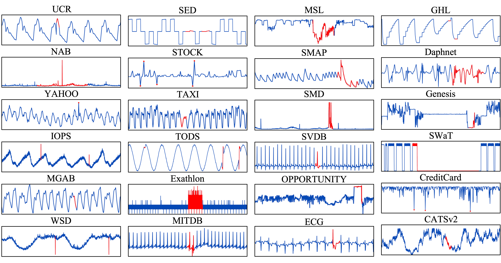

<p align="center">

</p>

<h1 align="center">TSB-AD</h1>
<h2 align="center">🐘 The Elephant in the Room: Towards A Reliable Time-Series Anomaly Detection Benchmark</h2>


Main Recent Update:
- [Sep. 26, 2024] Paper accepted to NeurIPS 2024 D&B Track!

## Table of Contents

- [📄 Overview](#overview)
- [⚙️ Get Started](#start)
    * [🗄️ Dataset](#dataset)
    * [💻 TSAD Algorithm](#tsad)
    * [🧑‍💻 Basic Usage](#usage)  
- [🏄‍♂️ Dive into TSB-AD](#tsb)


<h2 id="overview"> 📄 Overview </h2>

Time-series anomaly detection is a fundamental task across scientific fields and industries. However, the field has long faced the "elephant in the room:" critical issues including flawed datasets, biased evaluation metrics, and inconsistent benchmarking practices that have remained largely ignored and unaddressed.  We introduce the TSB-AD to systematically tackle these issues in the following three aspects: (i) Dataset Integrity: with 1020 high-quality time series refined from an initial collection of 4k spanning 33 diverse domains, we provide the first large-scale, heterogeneous, meticulously curated dataset that combines the effort of human perception and model interpretation; (ii) Metric Reliability: by revealing bias in evaluation metrics, we perform ranking aggregation on a set of reliable evaluation metrics for comprehensive capturing of model performance and robustness to address concerns from the community; (iii) Comprehensive Benchmarking: with a broad spectrum of 35 detection algorithms, from statistical methods to the latest foundation models, we perform systematic hyperparameter tuning for a fair and complete comparison. Our findings challenge the conventional wisdom regarding the superiority of advanced neural network architectures, revealing that simpler architectures and statistical methods often yield better performance. While foundation models demonstrate promise, we need to proceed with caution in terms of data contamination.

<h2 id="start"> ⚙️ Get Started </h2>

<h3 id="dataset">🗄️ Dataset</h3>

Due to limitations in the upload size on GitHub, we host the datasets at [Link] (Will be available along with the camera ready version).

<h3 id="tsad">💻 TSAD Algorithm</h3>

To install TSB-AD from source, you will need the following tools:
- `git`
- `conda` (anaconda or miniconda)

**Step 1:** Clone this repository using `git` and change into its root directory.

```bash
git clone https://github.com/TheDatumOrg/TSB-AD.git
```

**Step 2:** Create and activate a `conda` environment named `TSB-AD`.

```bash
conda create -n TSB-AD python=3.11    # Currently we support python>=3.8, up to 3.12
conda activate TSB-AD
```

**Step 3:** Install the dependencies from requirements.txt:
```bash
pip install -r requirements.txt
```

If you have problem installing `torch` using pip, try the following:
```bash
conda install pytorch==2.3.0 torchvision==0.18.0 torchaudio==2.3.0 pytorch-cuda=12.1 -c pytorch -c nvidia
```

> If you want to use Chronos, please install the following
```bash
git clone https://github.com/autogluon/autogluon
cd autogluon && pip install -e timeseries/[TimeSeriesDataFrame,TimeSeriesPredictor]
```

> If you want to use MOMENT, please install the following
```bash
pip install momentfm   # only support Python 3.11 for now
```

**Step 4:** Install the package:
```bash
pip install -e .
```

<h3 id="usage">🧑‍💻 Basic Usage</h3>

See Example in `TSB_AD/main.py`

```bash
python -m TSB_AD.main --AD_Name IForest
```

Or the following example on how to evaluate TSAD in 10 lines of code:
```bash
import pandas as pd
from TSB_AD.model_wrapper import run_Unsupervise_AD
from TSB_AD.evaluation.metrics import get_metrics

# Specify Anomaly Detector to use and data directory
AD_Name = 'IForest'   # It can be replaced with any anomaly detector availale in TSB-AD
data_direc = 'Datasets/TSB-AD-U/001_NAB_data_Traffic_4_624_2087.csv'

# Loading Data
df = pd.read_csv(data_direc).dropna()
data = df.iloc[:, 0:-1].values.astype(float)
label = df['Label'].astype(int).to_numpy()

# Applying Anomaly Detector
output = run_Unsupervise_AD(AD_Name, data)

# Evaluation
evaluation_result = get_metrics(output, label)
```

<h2 id="tsb"> 🏄‍♂️ Dive into TSB-AD </h2>

### Dataset Overview 

<p align="center">

</p>

> Example time series from TSB-AD, with anomalies highlighted in red. TSB-AD features high-quality labeled time series from a variety of domains, characterized by high variability in length and types of anomalies. Only one channel in a multivariate time series is visualized for brevity.

Specifically, TSB-AD includes the following datasets:

| Dataset    | Description|
|:--|:---------|
|UCR|is a collection of univariate time series of multiple domains including air temperature, arterial blood pressure, ABP, astronomy, EPG, ECG, gait, power demand, respiration, walking accelerator. Most of the anomalies are introduced artificially.|
|NAB|is composed of labeled real-world and artificial time series including AWS server metrics, online advertisement clicking rates, real-time traffic data, and a collection of Twitter mentions of large publicly-traded companies.|
|YAHOO|is a dataset published by Yahoo labs consisting of real and synthetic time series based on the real production traffic to some of the Yahoo production systems.|
|IOPS|is a dataset with performance indicators that reflect the scale, quality of web services, and health status of a machine.|
|MGAB|is composed of the Mackey-Glass time series, where anomalies exhibit chaotic behavior that is difficult for the human eye to distinguish.|
|WSD|is a web service dataset, which contains real-world KPIs collected from large Internet companies.|
|SED|a simulated engine disk data from the NASA Rotary Dynamics Laboratory representing disk revolutions recorded over several runs (3K rpm speed).|
|Stock|is a stock trading traces dataset, containing one million transaction records throughout the trading hours of a day.|
|Taxi|is a real-world dataset collected by the NYC Taxi and Limousine Commission, which represents the number of passengers over time. Five anomalies are the NYC Marathon, Thanksgiving, Christmas, New Year’s Day, and a snowstorm.|
|TODS|is a synthetic dataset that comprises global, contextual, shapelet, seasonal, and trend anomalies.|
|ECG|is a standard electrocardiogram dataset and the anomalies represent ventricular premature contractions.|
|GHL|contains the status of 3 reservoirs such as the temperature and level. Anomalies indicate changes in max temperature or pump frequency.|
|Daphnet|contains the annotated readings of 3 acceleration sensors at the hip and leg of Parkinson’s disease patients that experience freezing of gait (FoG) during walking tasks.|
|Exathlon|is based on real data traces collected from a Spark cluster over 2.5 months. For each of these anomalies, ground truth labels are provided for both the root cause interval and the corresponding effect interval.|
|Genesis|is a portable pick-and-place demonstrator that uses an air tank to supply all the gripping and storage units.|
|OPPORTUNITY|is devised to benchmark human activity recognition algorithms (e.g., classification, automatic data segmentation, sensor fusion, and feature extraction), which comprises the readings of motion sensors recorded while users executed typical daily activities.|
|SMD|is a 5-week-long dataset collected from a large Internet company, which contains 3 groups of entities from 28 different machines.|
|SWaT|is a secure water treatment dataset that is collected from 51 sensors and actuators, where the anomalies represent abnormal behaviors under attack scenarios.|
|WADI|is a water distribution dataset with data collected from 123 sensors and actuators under 16 days of continuous operation.|
|SMAP|is real spacecraft telemetry data with anomalies from Soil Moisture Active Passive satellite. It contains time series with one feature representing a sensor measurement, while the rest represent binary encoded commands.|
|MSL|is collected from Curiosity Rover on Mars satellite.|
|CreditCard|is an intrusion detection evaluation dataset, which consists of labeled network flows, including full packet payloads in pcap format, the corresponding profiles, and the labeled flows.|
|GECCO|is a water quality dataset used in a competition for online anomaly detection of drinking water quality.|
|MITDB|contains 48 half-hour excerpts of two-channel ambulatory ECG recordings, obtained from 47 subjects studied by the BIH Arrhythmia Laboratory between 1975 and 1979.|
|SVDB|includes 78 half-hour ECG recordings chosen to supplement the examples of supraventricular arrhythmias in the MIT-BIH Arrhythmia Database.|
|CATSv2|is the second version of the Controlled Anomalies Time Series (CATS) Dataset, which consists of commands, external stimuli, and telemetry readings of a simulated complex dynamical system with 200 injected anomalies.|


### Detection Algorithm

See Implementation in `TSB_AD/models`

We organize the detection algorithms in TSB-AD in the following three categories and arrange these algorithms chronologically within each category.

#### (i) Statistical Method

| Algorithm    | Description|
|:--|:---------|
|MCD|is based on minimum covariance determinant, which seeks to find a subset of all the sequences to estimate the mean and covariance matrix of the subset with minimal determinant. Subsequently, Mahalanobis distance is utilized to calculate the distance from sub-sequences to the mean, which is regarded as the anomaly score.|
|OCSVM|fits the dataset to find the normal data's boundary by maximizing the margin between the origin and the normal samples.|
|LOF|calculates the anomaly score by comparing local density with that of its neighbors.|
|KNN|produces the anomaly score of the input instance as the distance to its $k$-th nearest neighbor.|
|KMeansAD|calculates the anomaly scores for each sub-sequence by measuring the distance to the centroid of its assigned cluster, as determined by the k-means algorithm.|
|CBLOF|is clluster-based LOF, which calculates the anomaly score by first assigning samples to clusters, and then using the distance among clusters as anomaly scores.|
|POLY|detect pointwise anomolies using polynomial approximation. A GARCH method is run on the difference between the approximation and the true value of the dataset to estimate the volatility of each point.|
|IForest|constructs the binary tree, wherein the path length from the root to a node serves as an indicator of anomaly likelihood; shorter paths suggest higher anomaly probability.|
|HBOS|constructs a histogram for the data and uses the inverse of the height of the bin as the anomaly score of the data point.|
|MatrixProfile|identifies anomalies by pinpointing the subsequence exhibiting the most substantial nearest neighbor distance.|
|PCA|projects data to a lower-dimensional hyperplane, with significant deviation from this plane indicating potential outliers.|
|RobustPCA|is built upon PCA and identifies anomalies by recovering the principal matrix.|
|EIF|is an extension of the traditional Isolation Forest algorithm, which removes the branching bias using hyperplanes with random slopes.|
|COPOD|is a copula-based parameter-free detection algorithm, which first constructs an empirical copula, and then uses it to predict tail probabilities of each given data point to determine its level of extremeness.|
|NORMA|identifies the normal state based on clustering and calculates each point's effective distance to the normal state representation.|


#### (ii) Neural Network-based Method

| Algorithm    | Description|
|:--|:---------|
|AutoEncoder|projects data to the lower-dimensional latent space and then reconstruct it through the encoding-decoding phase, where anomalies are typically characterized by evident reconstruction deviations.|
|LSTMAD|utilizes Long Short-Term Memory (LSTM) networks to model the relationship between current and preceding time series data, detecting anomalies through discrepancies between predicted and actual values.|
|Donut|is a Variational AutoEncoder (VAE) based method and preprocesses the time series using the MCMC-based missing data imputation technique.|
|CNN|employ Convolutional Neural Network (CNN) to predict the next time stamp on the defined horizon and then compare the difference with the original value.|
|OmniAnomaly|is a stochastic recurrent neural network, which captures the normal patterns of time series by learning their robust representations with key techniques such as stochastic variable connection and planar normalizing flow, reconstructs input data by the representations, and use the reconstruction probabilities to determine anomalies.|
|USAD|is based on adversely trained autoencoders, and the anomaly score is the combination of discriminator and reconstruction loss.|
|AnomalyTransformer|utilizes the `Anomaly-Attention' mechanism to compute the association discrepancy.|
|TranAD|is a deep transformer network-based method, which leverages self-conditioning and adversarial training to amplify errors and gain training stability.|
|TimesNet|is a general time series analysis model with applications in forecasting, classification, and anomaly detection. It features TimesBlock, which can discover the multi-periodicity adaptively and extract the complex temporal variations from transformed 2D tensors by a parameter-efficient inception block.|
|FITS|is a lightweight model that operates on the principle that time series can be manipulated through interpolation in the complex frequency domain.|

#### (iii) Foundation Model-based Method

| Algorithm    | Description|
|:--|:---------|
|OFA|finetunes pre-trained GPT-2 model on time series data while keeping self-attention and feedforward layers of the residual blocks in the pre-trained language frozen.|
|Lag-Llama|is the first foundation model for univariate probabilistic time series forecasting based on a decoder-only transformer architecture that uses lags as covariates.|
|Chronos|tokenizes time series values using scaling and quantization into a fixed vocabulary and trains the T5 model on these tokenized time series via the cross-entropy loss.|
|TimesFM|is based on pretraining a decoder-style attention model with input patching, using a large time-series corpus comprising both real-world and synthetic datasets.|
|MOMENT|is pre-trained T5 encoder based on a masked time-series modeling approach.|


### TSAD Leaderboard

> Summary accuracy comparison of mean value on TSB-AD-U and TSB-AD-M

## Summary accuracy comparison of mean value on TSB-AD-U and TSB-AD-M

The methods are sorted from top to bottom based on their Aggregated Mean Value Ranking. The best-performing method as per each metric is marked in **bold** and the second best is marked in _underline_.

> TSB-AD-U

| Method               | AUC-PR | AUC-ROC | VUS-PR | VUS-ROC | Standard-F1 | PA-F1 | Event-based-F1 | R-based-F1 | Affiliation-F1 |
|----------------------|--------|---------|--------|---------|-------------|-------|----------------|------------|----------------|
| NORMA                | **0.38** | _0.79_ | 0.46   | 0.81    | **0.42**    | 0.63  | 0.42           | **0.41**   | **0.73**       |
| MOMENT (FT)          | 0.32   | 0.76    | **0.48** | _0.81_ | 0.39        | 0.72  | 0.52           | 0.33       | 0.62           |
| Sub-PCA              | _0.37_ | 0.71    | 0.45   | 0.76    | _0.41_      | 0.55  | 0.41           | _0.40_     | 0.68           |
| CNN                  | 0.31   | 0.71    | 0.30   | 0.75    | 0.37        | 0.79  | _0.64_         | 0.35       | 0.67           |
| Sub-MCD              | 0.31   | **0.79** | _0.48_ | **0.85** | 0.37        | 0.64  | 0.44           | 0.33       | 0.70           |
| TimesFM              | 0.27   | 0.67    | 0.25   | 0.70    | 0.32        | **0.84** | **0.64**     | 0.35       | 0.65           |
| Lag-Llama            | 0.27   | 0.64    | 0.25   | 0.69    | 0.32        | 0.77  | 0.57           | 0.34       | 0.63           |
| LSTMAD               | 0.29   | 0.66    | 0.29   | 0.72    | 0.35        | 0.70  | 0.55           | 0.32       | 0.64           |
| OmniAnomaly          | 0.31   | 0.65    | 0.38   | 0.70    | 0.35        | 0.47  | 0.32           | 0.38       | 0.63           |
| Sub-IForest          | 0.32   | 0.72    | 0.39   | 0.77    | 0.36        | 0.54  | 0.37           | 0.31       | 0.66           |
| IForest              | 0.30   | 0.72    | 0.28   | 0.74    | 0.37        | 0.74  | 0.54           | 0.31       | _0.73_         |
| MOMENT (ZS)          | 0.25   | 0.68    | 0.40   | 0.75    | 0.32        | 0.65  | 0.44           | 0.31       | 0.67           |
| Chronos              | 0.26   | 0.65    | 0.22   | 0.69    | 0.31        | _0.84_ | 0.63           | 0.33       | 0.63           |
| Sub-LOF              | 0.23   | 0.71    | 0.39   | 0.78    | 0.32        | 0.64  | 0.40           | 0.33       | 0.64           |
| Sub-HBOS             | 0.30   | 0.70    | 0.37   | 0.74    | 0.36        | 0.50  | 0.32           | 0.33       | 0.66           |
| POLY                 | 0.28   | 0.69    | 0.40   | 0.73    | 0.34        | 0.52  | 0.30           | 0.32       | 0.70           |
| USAD                 | 0.25   | 0.63    | 0.29   | 0.70    | 0.30        | 0.57  | 0.41           | 0.29       | 0.66           |
| MatrixProfile        | 0.25   | 0.73    | 0.38   | 0.77    | 0.31        | 0.58  | 0.33           | 0.29       | 0.65           |
| AutoEncoder          | 0.25   | 0.75    | 0.36   | 0.79    | 0.31        | 0.60  | 0.35           | 0.29       | 0.71           |
| TranAD               | 0.19   | 0.59    | 0.26   | 0.68    | 0.25        | 0.57  | 0.39           | 0.23       | 0.65           |
| OFA                  | 0.13   | 0.58    | 0.22   | 0.68    | 0.19        | 0.65  | 0.41           | 0.17       | 0.61           |
| FITS                 | 0.14   | 0.58    | 0.24   | 0.70    | 0.19        | 0.62  | 0.36           | 0.17       | 0.62           |
| Donut                | 0.14   | 0.57    | 0.22   | 0.68    | 0.20        | 0.56  | 0.34           | 0.18       | 0.58           |
| TimesNet             | 0.13   | 0.59    | 0.22   | 0.70    | 0.19        | 0.59  | 0.32           | 0.16       | 0.62           |
| AnomalyTransformer   | 0.06   | 0.50    | 0.15   | 0.54    | 0.10        | 0.57  | 0.34           | 0.12       | 0.53           |

> TSB-AD-M

| Method               | AUC-PR | AUC-ROC | VUS-PR | VUS-ROC | Standard-F1 | PA-F1 | Event-based-F1 | R-based-F1 | Affiliation-F1 |
|----------------------|--------|---------|--------|---------|-------------|-------|----------------|------------|----------------|
| KMeansAD             | **0.32** | **0.73** | **0.31** | **0.75** | **0.37**    | 0.78  | 0.44           | **0.38**   | 0.47           |
| LSTMAD               | 0.28   | 0.67    | 0.27   | 0.70    | 0.33        | 0.81  | _0.57_         | 0.34       | 0.59           |
| CNN                  | 0.26   | 0.72    | 0.27   | _0.74_ | 0.33        | 0.80  | 0.55           | 0.32       | 0.57           |
| IForest              | _0.29_ | _0.72_  | _0.29_ | 0.74    | _0.34_      | 0.79  | 0.53           | 0.23       | **0.72**       |
| PCA                  | 0.27   | 0.69    | 0.28   | 0.72    | 0.34        | 0.80  | 0.54           | 0.25       | 0.59           |
| COPOD                | 0.28   | 0.71    | 0.28   | 0.73    | 0.33        | 0.78  | 0.51           | 0.23       | 0.68           |
| CBLOF                | 0.26   | 0.71    | 0.26   | 0.73    | 0.31        | 0.76  | 0.51           | 0.30       | 0.60           |
| OmniAnomaly          | 0.27   | 0.63    | 0.29   | 0.66    | 0.33        | 0.56  | 0.31           | _0.38_     | 0.54           |
| MCD                  | 0.27   | 0.68    | 0.27   | 0.70    | 0.32        | 0.70  | 0.46           | 0.23       | 0.50           |
| AutoEncoder          | 0.23   | 0.65    | 0.25   | 0.68    | 0.28        | 0.77  | 0.46           | 0.27       | 0.67           |
| HBOS                 | 0.23   | 0.67    | 0.23   | 0.69    | 0.29        | 0.77  | 0.54           | 0.23       | 0.68           |
| KNN                  | 0.21   | 0.62    | 0.22   | 0.64    | 0.26        | _0.84_ | **0.59**      | 0.26       | 0.43           |
| USAD                 | 0.22   | 0.59    | 0.23   | 0.63    | 0.27        | 0.70  | 0.43           | 0.34       | 0.59           |
| OCSVM                | 0.24   | 0.64    | 0.26   | 0.66    | 0.28        | 0.71  | 0.43           | 0.26       | 0.58           |
| EIF                  | 0.21   | 0.71    | 0.22   | 0.74    | 0.28        | 0.80  | 0.50           | 0.26       | _0.71_         |
| RobustPCA            | 0.22   | 0.64    | 0.22   | 0.68    | 0.28        | 0.72  | 0.43           | 0.22       | 0.61           |
| TranAD               | 0.17   | 0.56    | 0.18   | 0.59    | 0.24        | 0.74  | 0.43           | 0.26       | 0.57           |
| Donut                | 0.22   | 0.63    | 0.24   | 0.68    | 0.28        | 0.71  | 0.33           | 0.23       | 0.52           |
| TimesNet             | 0.17   | 0.60    | 0.20   | 0.65    | 0.24        | **0.85** | 0.49        | 0.20       | 0.57           |
| FITS                 | 0.17   | 0.59    | 0.20   | 0.65    | 0.23        | 0.81  | 0.34           | 0.17       | 0.56           |
| OFA                  | 0.15   | 0.56    | 0.18   | 0.63    | 0.21        | 0.81  | 0.42           | 0.17       | 0.55           |
| LOF                  | 0.11   | 0.57    | 0.13   | 0.60    | 0.17        | 0.79  | 0.40           | 0.17       | 0.50           |
| AnomalyTransformer   | 0.06   | 0.51    | 0.20   | 0.52    | 0.11        | 0.63  | 0.31           | 0.10       | 0.46           |


### ✉️ Contact

If you have any questions or suggestions, feel free to contact:
* Qinghua Liu (liu.11085@osu.edu)
* John Paparrizos (paparrizos.1@osu.edu)

Or describe it in Issues.


### 🎉 Acknowledgement
We appreciate the following github repos a lot for their valuable code base:
* https://github.com/yzhao062/pyod
* https://github.com/TimeEval/TimeEval-algorithms
* https://github.com/thuml/Time-Series-Library/
* https://github.com/dawnvince/EasyTSAD