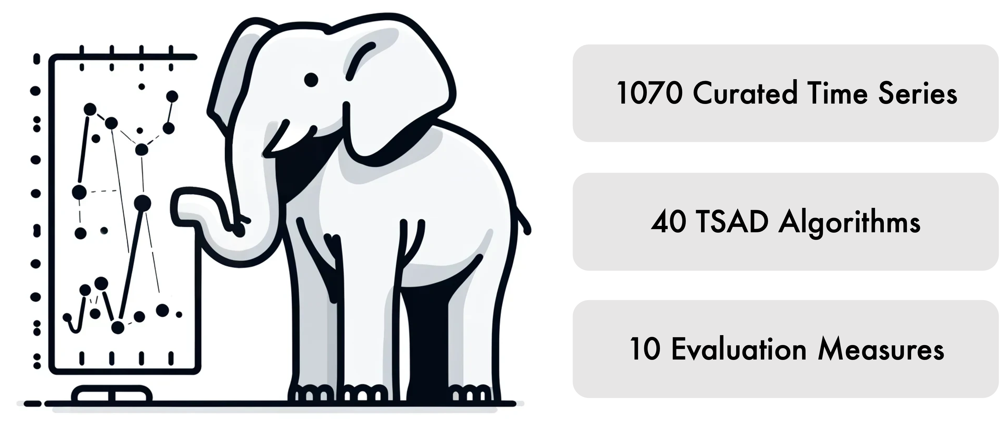

<p align="center">

</p>

<h1 align="center">TSB-AD</h1>
<h2 align="center">🐘 The Elephant in the Room: Towards A Reliable Time-Series Anomaly Detection Benchmark</h2>

<p align="center">
 
 

</p>

Main Recent Update:
- [Nov. 20, 2024] [Project homepage](https://thedatumorg.github.io/TSB-AD/) is online and release TSB-AD-U/M dataset.
- [Nov. 6, 2024] Pip-installable package released (pip install TSB-AD).
- [Sep. 26, 2024] Paper accepted to NeurIPS 2024 D&B Track!

Related Repository:
- [TSB-UAD](https://github.com/TheDatumOrg/TSB-UAD): An End-to-End Benchmark Suite for Univariate Time-Series Anomaly Detection.
- [VUS](https://github.com/TheDatumOrg/VUS): A New Accuracy Evaluation Measure for Time-Series Anomaly Detection.

If you find our work helpful, please consider citing:

<details>
<summary>"The Elephant in the Room: Towards A Reliable Time-Series Anomaly Detection Benchmark" Qinghua Liu and John Paparrizos. NeurIPS 2024.</summary>

```bibtex
@inproceedings{liu2024elephant,
  title={The Elephant in the Room: Towards A Reliable Time-Series Anomaly Detection Benchmark},
  author={Liu, Qinghua and Paparrizos, John},
  booktitle={NeurIPS 2024},
  year={2024}
}
```
</details>

<details>
<summary>"TSB-UAD: An End-to-End Benchmark Suite for Univariate Time-Series Anomaly Detection" John Paparrizos, Yuhao Kang, Paul Boniol, Ruey Tsay, Themis Palpanas, and Michael Franklin. VLDB 2022.</summary>

```bibtex
@article{paparrizos2022tsb,
  title={Tsb-uad: an end-to-end benchmark suite for univariate time-series anomaly detection},
  author={Paparrizos, John and Kang, Yuhao and Boniol, Paul and Tsay, Ruey S and Palpanas, Themis and Franklin, Michael J},
  journal={Proceedings of the VLDB Endowment},
  volume={15},
  number={8},
  pages={1697--1711},
  year={2022},
  publisher={VLDB Endowment}
}
```
</details>

<details>

<summary>"Volume Under the Surface: A New Accuracy Evaluation Measure for Time-Series Anomaly Detection" John Paparrizos, Paul Boniol, Themis Palpanas, Ruey Tsay, Aaron Elmore, and Michael Franklin. VLDB 2022.</summary>

```bibtex
@article{paparrizos2022volume,
  title={{Volume Under the Surface: A New Accuracy Evaluation Measure for Time-Series Anomaly Detection}},
  author={Paparrizos, John and Boniol, Paul and Palpanas, Themis and Tsay, Ruey S and Elmore, Aaron and Franklin, Michael J},
  journal={Proceedings of the VLDB Endowment},
  volume={15},
  number={11},
  pages={2774--2787},
  year={2022},
  publisher={VLDB Endowment}
}
```
</details>


## Table of Contents

- [📄 Overview](#overview)
- [⚙️ Get Started](#start)
    * [🗄️ Dataset](#dataset)
    * [💻 Installation](#tsad)
    * [🧑‍💻 Basic Usage](#usage)  
    * [🧑‍💻 Customized Development](#custom)
- [🏄‍♂️ Dive into TSB-AD](#tsb)


<h2 id="overview"> 📄 Overview </h2>

Time-series anomaly detection is a fundamental task across scientific fields and industries. However, the field has long faced the ''🐘 elephant in the room:'' critical issues including flawed datasets, biased evaluation measures, and inconsistent benchmarking practices that have remained largely ignored and unaddressed. We introduce the TSB-AD to systematically tackle these issues in the following three aspects: (i) Dataset Integrity: with 1070 high-quality time series from a diverse collection of 40 datasets (doubling the size of the largest collection and four times the number of existing curated datasets), we provide the first large-scale, heterogeneous, meticulously curated dataset that combines the effort of human perception and model interpretation; (ii) Measure Reliability: by revealing issues and biases in evaluation measures, we identify the most reliable and accurate measure, namely, VUS-PR for anomaly detection in time series to address concerns from the community; and (iii) Comprehensive Benchmarking: with a broad spectrum of 40 detection algorithms, from statistical methods to the latest foundation models, we perform a comprehensive evaluation that includes a thorough hyperparameter tuning and a unified setup for a fair and reproducible comparison. Our findings challenge the conventional wisdom regarding the superiority of advanced neural network architectures, revealing that simpler architectures and statistical methods often yield better performance. The promising performance of neural networks on multivariate cases and foundation models on point anomalies highlights the need for further advancements in these methods.

<h2 id="start"> ⚙️ Get Started </h2>

<h3 id="dataset">🗄️ Dataset</h3>

Due to limitations in the upload size on GitHub, we host the datasets at a different location. Please download the datasets using the following links:

* TSB-AD-U: https://www.thedatum.org/datasets/TSB-AD-U.zip

* TSB-AD-M: https://www.thedatum.org/datasets/TSB-AD-M.zip

> Disclaimer: The dataset is released for reproducibility purposes. The preprocessing and curation steps are provided under the Apache 2.0 license. If you use any of these datasets in your research, please refer to the original data source. License information for each dataset included in TSB-AD is provided at [[Link]](https://thedatumorg.github.io/TSB-AD/) for your reference.

The split of Tuning and Eval set in our benchmark study is available at [[Link]](https://github.com/TheDatumOrg/TSB-AD/tree/main/Datasets/File_List/).

<h3 id="tsad">💻 Installation</h3>

You can install TSB-AD with [pip](https://pypi.org/project/TSB-AD/):

```bash
pip install TSB-AD
```

To install TSB-AD from source, you will need the following tools:
- `git`
- `conda` (anaconda or miniconda)

**Step 1:** Clone this repository using `git` and change into its root directory.

```bash
git clone https://github.com/TheDatumOrg/TSB-AD.git
```

**Step 2:** Create and activate a `conda` environment named `TSB-AD`.

```bash
conda create -n TSB-AD python=3.11    # Currently we support python>=3.8, up to 3.12
conda activate TSB-AD
```

**Step 3:** Install the dependencies from requirements.txt:
```bash
pip install -r requirements.txt
```

If you have problem installing `torch` using pip, try the following:
```bash
conda install pytorch==2.3.0 torchvision==0.18.0 torchaudio==2.3.0 pytorch-cuda=12.1 -c pytorch -c nvidia
```

For instructions on the installation of Foundation Models, please refer to [link](https://github.com/TheDatumOrg/TSB-AD/tree/main/TSB_AD/models/README.md).

**Step 4:** Install the package:
```bash
pip install -e .
```

<h3 id="usage">🧑‍💻 Basic Usage</h3>

See Example in `TSB_AD/main.py`

```bash
python -m TSB_AD.main --AD_Name IForest
```

Or the following example on how to evaluate TSAD in 10 lines of code:
```bash
import pandas as pd
from TSB_AD.model_wrapper import run_Unsupervise_AD
from TSB_AD.evaluation.metrics import get_metrics

# Specify Anomaly Detector to use and data directory
AD_Name = 'IForest'   # It can be replaced with any anomaly detector availale in TSB-AD
data_direc = 'Datasets/TSB-AD-U/001_NAB_id_1_Facility_tr_1007_1st_2014.csv'

# Loading Data
df = pd.read_csv(data_direc).dropna()
data = df.iloc[:, 0:-1].values.astype(float)
label = df['Label'].astype(int).to_numpy()

# Applying Anomaly Detector
output = run_Unsupervise_AD(AD_Name, data)

# Evaluation
evaluation_result = get_metrics(output, label)
```

<h3 id="custom">🧑‍💻 Customized Development</h3>

Examples of how to run the benchmark experiments and develop your own algorithms can be find [here](https://github.com/TheDatumOrg/TSB-AD/tree/main/benchmark_exp), including:

* Hper-parameter Tuning Scripts
* Benchmark Evaluation Scripts
* Evaluation results of anomaly detectors across different time series in TSB-AD
* Develop your own algorithm

🪧 How to commit your own algorithm to TSB-AD: you can send us the Run_Custom_Detector.py (replace Custom_Detector with the model name) to us via (i) [email](liu.11085@osu.edu) or (ii) open a pull request and add the file to `benchmark_exp` folder in `TSB-AD-algo` branch. We will test and evaluate the algorithm and include it in our [leaderboard](https://thedatumorg.github.io/TSB-AD/).


<h2 id="tsb"> 🏄‍♂️ Dive into TSB-AD </h2>

### Dataset Overview 

<p align="center">

</p>

> Example time series from TSB-AD, with anomalies highlighted in red. TSB-AD features high-quality labeled time series from a variety of domains, characterized by high variability in length and types of anomalies. Only one channel in a multivariate time series is visualized for brevity.

### Detection Algorithm

See Implementation in `TSB_AD/models`

We organize the detection algorithms in TSB-AD in the following three categories and arrange these algorithms chronologically within each category.

#### (i) Statistical Method

| Algorithm    | Description|
|:--|:---------|
|(Sub)-MCD|is based on minimum covariance determinant, which seeks to find a subset of all the sequences to estimate the mean and covariance matrix of the subset with minimal determinant. Subsequently, Mahalanobis distance is utilized to calculate the distance from sub-sequences to the mean, which is regarded as the anomaly score.|
|(Sub)-OCSVM|fits the dataset to find the normal data's boundary by maximizing the margin between the origin and the normal samples.|
|(Sub)-LOF|calculates the anomaly score by comparing local density with that of its neighbors.|
|(Sub)-KNN|produces the anomaly score of the input instance as the distance to its $k$-th nearest neighbor.|
|KMeansAD|calculates the anomaly scores for each sub-sequence by measuring the distance to the centroid of its assigned cluster, as determined by the k-means algorithm.|
|CBLOF|is clluster-based LOF, which calculates the anomaly score by first assigning samples to clusters, and then using the distance among clusters as anomaly scores.|
|POLY|detect pointwise anomolies using polynomial approximation. A GARCH method is run on the difference between the approximation and the true value of the dataset to estimate the volatility of each point.|
|(Sub)-IForest|constructs the binary tree, wherein the path length from the root to a node serves as an indicator of anomaly likelihood; shorter paths suggest higher anomaly probability.|
|(Sub)-HBOS|constructs a histogram for the data and uses the inverse of the height of the bin as the anomaly score of the data point.|
|KShapeAD| identifies the normal pattern based on the k-Shape clustering algorithm and computes anomaly scores based on the distance between each sub-sequence and the normal pattern. KShapeAD improves KMeansAD as it relies on a more robust time-series clustering method and corresponds to an offline version of the streaming SAND method.|
|MatrixProfile|identifies anomalies by pinpointing the subsequence exhibiting the most substantial nearest neighbor distance.|
|(Sub)-PCA|projects data to a lower-dimensional hyperplane, with significant deviation from this plane indicating potential outliers.|
|RobustPCA|is built upon PCA and identifies anomalies by recovering the principal matrix.|
|EIF|is an extension of the traditional Isolation Forest algorithm, which removes the branching bias using hyperplanes with random slopes.|
|SR| begins by computing the Fourier Transform of the data, followed by the spectral residual of the log amplitude. The Inverse Fourier Transform then maps the sequence back to the time domain, creating a saliency map. The anomaly score is calculated as the relative difference between saliency map values and their moving averages.|
|COPOD|is a copula-based parameter-free detection algorithm, which first constructs an empirical copula, and then uses it to predict tail probabilities of each given data point to determine its level of extremeness.|
|Series2Graph| converts the time series into a directed graph representing the evolution of subsequences in time. The anomalies are detected using the weight and the degree of the nodes and edges respectively.|
|SAND| identifies the normal pattern based on clustering updated through arriving batches (i.e., subsequences) and calculates each point's effective distance to the normal pattern.|


#### (ii) Neural Network-based Method

| Algorithm    | Description|
|:--|:---------|
|AutoEncoder|projects data to the lower-dimensional latent space and then reconstruct it through the encoding-decoding phase, where anomalies are typically characterized by evident reconstruction deviations.|
|LSTMAD|utilizes Long Short-Term Memory (LSTM) networks to model the relationship between current and preceding time series data, detecting anomalies through discrepancies between predicted and actual values.|
|Donut|is a Variational AutoEncoder (VAE) based method and preprocesses the time series using the MCMC-based missing data imputation technique.|
|CNN|employ Convolutional Neural Network (CNN) to predict the next time stamp on the defined horizon and then compare the difference with the original value.|
|OmniAnomaly|is a stochastic recurrent neural network, which captures the normal patterns of time series by learning their robust representations with key techniques such as stochastic variable connection and planar normalizing flow, reconstructs input data by the representations, and use the reconstruction probabilities to determine anomalies.|
|USAD|is based on adversely trained autoencoders, and the anomaly score is the combination of discriminator and reconstruction loss.|
|AnomalyTransformer|utilizes the `Anomaly-Attention' mechanism to compute the association discrepancy.|
|TranAD|is a deep transformer network-based method, which leverages self-conditioning and adversarial training to amplify errors and gain training stability.|
|TimesNet|is a general time series analysis model with applications in forecasting, classification, and anomaly detection. It features TimesBlock, which can discover the multi-periodicity adaptively and extract the complex temporal variations from transformed 2D tensors by a parameter-efficient inception block.|
|FITS|is a lightweight model that operates on the principle that time series can be manipulated through interpolation in the complex frequency domain.|
|M2N2|uses exponential moving average for trend estimation to detrend data and updates model with normal test instances based on predictions for unsupervised TSAD distribution shifts.

#### (iii) Foundation Model-based Method

| Algorithm    | Description|
|:--|:---------|
|OFA|finetunes pre-trained GPT-2 model on time series data while keeping self-attention and feedforward layers of the residual blocks in the pre-trained language frozen.|
|Lag-Llama|is the first foundation model for univariate probabilistic time series forecasting based on a decoder-only transformer architecture that uses lags as covariates.|
|Chronos|tokenizes time series values using scaling and quantization into a fixed vocabulary and trains the T5 model on these tokenized time series via the cross-entropy loss.|
|TimesFM|is based on pretraining a decoder-style attention model with input patching, using a large time-series corpus comprising both real-world and synthetic datasets.|
|MOMENT|is pre-trained T5 encoder based on a masked time-series modeling approach.|


### ✉️ Contact

If you have any questions or suggestions, feel free to contact:
* Qinghua Liu (liu.11085@osu.edu)
* John Paparrizos (paparrizos.1@osu.edu)

Or describe it in Issues.

### 🎉 Acknowledgement
We appreciate the following github repos a lot for their valuable code base:
* https://github.com/yzhao062/pyod
* https://github.com/TimeEval/TimeEval-algorithms
* https://github.com/thuml/Time-Series-Library/
* https://github.com/dawnvince/EasyTSAD
