# Getting started with TinyTimeMixer (TTM)

This notebooke demonstrates the usage of a pre-trained `TinyTimeMixer` model for several multivariate time series forecasting tasks. For details related to model architecture, refer to the [TTM paper](https://arxiv.org/pdf/2401.03955.pdf).

In this example, we will use a pre-trained TTM-512-96 model. That means the TTM model can take an input of 512 time points (`context_length`), and can forecast upto 96 time points (`forecast_length`) in the future. We will use the pre-trained TTM in two settings:
1. **Zero-shot**: The pre-trained TTM will be directly used to evaluate on the `test` split of the target data. Note that the TTM was NOT pre-trained on the target data.
2. **Few-shot**: The pre-trained TTM will be quickly fine-tuned on only 5% of the `train` split of the target data, and subsequently, evaluated on the `test` part of the target data.

Note: Alternatively, this notebook can be modified to try any other TTM model from a suite of TTM models. For details, visit the [Hugging Face TTM Model Repository](https://huggingface.co/ibm-granite/granite-timeseries-ttm-r2).

1. IBM Granite TTM-R1 pre-trained models can be found here: [Granite-TTM-R1 Model Card](https://huggingface.co/ibm-granite/granite-timeseries-ttm-r1)
2. IBM Granite TTM-R2 pre-trained models can be found here: [Granite-TTM-R2 Model Card](https://huggingface.co/ibm-granite/granite-timeseries-ttm-r2)
3. Research-use (non-commercial use only) TTM-R2 pre-trained models can be found here: [Research-Use-TTM-R2](https://huggingface.co/ibm-research/ttm-research-r2)

### The get_model() utility
TTM Model card offers a suite of models with varying `context_length` and `prediction_length` combinations.
In this notebook, we will utilize the TSFM `get_model()` utility that automatically selects the right model based on the given input `context_length` and `prediction_length` (and some other optional arguments) abstracting away the internal complexity. See the usage examples below in the `zeroshot_eval()` and `fewshot_finetune_eval()` functions. For more details see the [docstring](https://github.com/ibm-granite/granite-tsfm/blob/main/tsfm_public/toolkit/get_model.py) of the function definition.

## Install `tsfm` 
**[Optional for Local Run / Mandatory for Google Colab]**  
Run the below cell to install `tsfm`. Skip if already installed.

## Imports


```python
import math
import os
import tempfile

import pandas as pd
import torch
from torch.optim import AdamW
from torch.optim.lr_scheduler import OneCycleLR
from transformers import EarlyStoppingCallback, Trainer, TrainingArguments, set_seed
from transformers.integrations import INTEGRATION_TO_CALLBACK

from tsfm_public import TimeSeriesPreprocessor, TrackingCallback, count_parameters, get_datasets
from tsfm_public.toolkit.get_model import get_model
from tsfm_public.toolkit.lr_finder import optimal_lr_finder
from tsfm_public.toolkit.visualization import plot_predictions
```


```python
import warnings

# Suppress all warnings
warnings.filterwarnings("ignore")
```

### Important arguments


```python
# Install the tsfm library
! pip install "granite-tsfm[notebooks] @ git+https://github.com/ibm-granite/granite-tsfm.git@v0.2.22"
```

    Collecting granite-tsfm@ git+https://github.com/ibm-granite/granite-tsfm.git@v0.2.22 (from granite-tsfm[notebooks]@ git+https://github.com/ibm-granite/granite-tsfm.git@v0.2.22)
      Cloning https://github.com/ibm-granite/granite-tsfm.git (to revision v0.2.22) to /tmp/pip-install-_5l2us3u/granite-tsfm_21986ab696664794a20becc86d439587
      Running command git clone --filter=blob:none --quiet https://github.com/ibm-granite/granite-tsfm.git /tmp/pip-install-_5l2us3u/granite-tsfm_21986ab696664794a20becc86d439587
      Running command git checkout -q 216850d0cb073e31689049c1334f701fe11bc2c3
      Resolved https://github.com/ibm-granite/granite-tsfm.git to commit 216850d0cb073e31689049c1334f701fe11bc2c3
      Installing build dependencies ... [?25ldone
    [?25h  Getting requirements to build wheel ... [?25ldone
    [?25h  Preparing metadata (pyproject.toml) ... [?25ldone
    [?25hRequirement already satisfied: pandas>=2.2.0 in /home/ayumi/.pyenv/versions/3.10.18/lib/python3.10/site-packages (from granite-tsfm@ git+https://github.com/ibm-granite/granite-tsfm.git@v0.2.22->granite-tsfm[notebooks]@ git+https://github.com/ibm-granite/granite-tsfm.git@v0.2.22) (2.3.0)
    Requirement already satisfied: scikit-learn in /home/ayumi/.pyenv/versions/3.10.18/lib/python3.10/site-packages (from granite-tsfm@ git+https://github.com/ibm-granite/granite-tsfm.git@v0.2.22->granite-tsfm[notebooks]@ git+https://github.com/ibm-granite/granite-tsfm.git@v0.2.22) (1.3.2)
    Requirement already satisfied: transformers>=4.38.0 in /home/ayumi/.pyenv/versions/3.10.18/lib/python3.10/site-packages (from transformers[torch]>=4.38.0->granite-tsfm@ git+https://github.com/ibm-granite/granite-tsfm.git@v0.2.22->granite-tsfm[notebooks]@ git+https://github.com/ibm-granite/granite-tsfm.git@v0.2.22) (4.38.0)
    Requirement already satisfied: datasets in /home/ayumi/.pyenv/versions/3.10.18/lib/python3.10/site-packages (from granite-tsfm@ git+https://github.com/ibm-granite/granite-tsfm.git@v0.2.22->granite-tsfm[notebooks]@ git+https://github.com/ibm-granite/granite-tsfm.git@v0.2.22) (3.6.0)
    Requirement already satisfied: deprecated in /home/ayumi/.pyenv/versions/3.10.18/lib/python3.10/site-packages (from granite-tsfm@ git+https://github.com/ibm-granite/granite-tsfm.git@v0.2.22->granite-tsfm[notebooks]@ git+https://github.com/ibm-granite/granite-tsfm.git@v0.2.22) (1.2.18)
    Requirement already satisfied: urllib3<2,>=1.26.19 in /home/ayumi/.pyenv/versions/3.10.18/lib/python3.10/site-packages (from granite-tsfm@ git+https://github.com/ibm-granite/granite-tsfm.git@v0.2.22->granite-tsfm[notebooks]@ git+https://github.com/ibm-granite/granite-tsfm.git@v0.2.22) (1.26.20)
    Requirement already satisfied: numpy<2 in /home/ayumi/.pyenv/versions/3.10.18/lib/python3.10/site-packages (from granite-tsfm@ git+https://github.com/ibm-granite/granite-tsfm.git@v0.2.22->granite-tsfm[notebooks]@ git+https://github.com/ibm-granite/granite-tsfm.git@v0.2.22) (1.26.4)
    Requirement already satisfied: jupyter in /home/ayumi/.pyenv/versions/3.10.18/lib/python3.10/site-packages (from granite-tsfm@ git+https://github.com/ibm-granite/granite-tsfm.git@v0.2.22->granite-tsfm[notebooks]@ git+https://github.com/ibm-granite/granite-tsfm.git@v0.2.22) (1.1.1)
    Requirement already satisfied: matplotlib in /home/ayumi/.pyenv/versions/3.10.18/lib/python3.10/site-packages (from granite-tsfm@ git+https://github.com/ibm-granite/granite-tsfm.git@v0.2.22->granite-tsfm[notebooks]@ git+https://github.com/ibm-granite/granite-tsfm.git@v0.2.22) (3.7.5)
    Requirement already satisfied: ipywidgets in /home/ayumi/.pyenv/versions/3.10.18/lib/python3.10/site-packages (from granite-tsfm@ git+https://github.com/ibm-granite/granite-tsfm.git@v0.2.22->granite-tsfm[notebooks]@ git+https://github.com/ibm-granite/granite-tsfm.git@v0.2.22) (8.1.7)
    Requirement already satisfied: plotly in /home/ayumi/.pyenv/versions/3.10.18/lib/python3.10/site-packages (from granite-tsfm@ git+https://github.com/ibm-granite/granite-tsfm.git@v0.2.22->granite-tsfm[notebooks]@ git+https://github.com/ibm-granite/granite-tsfm.git@v0.2.22) (6.1.2)
    Requirement already satisfied: kaleido in /home/ayumi/.pyenv/versions/3.10.18/lib/python3.10/site-packages (from granite-tsfm@ git+https://github.com/ibm-granite/granite-tsfm.git@v0.2.22->granite-tsfm[notebooks]@ git+https://github.com/ibm-granite/granite-tsfm.git@v0.2.22) (0.2.1)
    Requirement already satisfied: tensorboard in /home/ayumi/.pyenv/versions/3.10.18/lib/python3.10/site-packages (from granite-tsfm@ git+https://github.com/ibm-granite/granite-tsfm.git@v0.2.22->granite-tsfm[notebooks]@ git+https://github.com/ibm-granite/granite-tsfm.git@v0.2.22) (2.19.0)
    Requirement already satisfied: python-dateutil>=2.8.2 in /home/ayumi/.pyenv/versions/3.10.18/lib/python3.10/site-packages (from pandas>=2.2.0->granite-tsfm@ git+https://github.com/ibm-granite/granite-tsfm.git@v0.2.22->granite-tsfm[notebooks]@ git+https://github.com/ibm-granite/granite-tsfm.git@v0.2.22) (2.9.0.post0)
    Requirement already satisfied: pytz>=2020.1 in /home/ayumi/.pyenv/versions/3.10.18/lib/python3.10/site-packages (from pandas>=2.2.0->granite-tsfm@ git+https://github.com/ibm-granite/granite-tsfm.git@v0.2.22->granite-tsfm[notebooks]@ git+https://github.com/ibm-granite/granite-tsfm.git@v0.2.22) (2025.2)
    Requirement already satisfied: tzdata>=2022.7 in /home/ayumi/.pyenv/versions/3.10.18/lib/python3.10/site-packages (from pandas>=2.2.0->granite-tsfm@ git+https://github.com/ibm-granite/granite-tsfm.git@v0.2.22->granite-tsfm[notebooks]@ git+https://github.com/ibm-granite/granite-tsfm.git@v0.2.22) (2025.2)
    Requirement already satisfied: filelock in /home/ayumi/.pyenv/versions/3.10.18/lib/python3.10/site-packages (from transformers>=4.38.0->transformers[torch]>=4.38.0->granite-tsfm@ git+https://github.com/ibm-granite/granite-tsfm.git@v0.2.22->granite-tsfm[notebooks]@ git+https://github.com/ibm-granite/granite-tsfm.git@v0.2.22) (3.18.0)
    Requirement already satisfied: huggingface-hub<1.0,>=0.19.3 in /home/ayumi/.pyenv/versions/3.10.18/lib/python3.10/site-packages (from transformers>=4.38.0->transformers[torch]>=4.38.0->granite-tsfm@ git+https://github.com/ibm-granite/granite-tsfm.git@v0.2.22->granite-tsfm[notebooks]@ git+https://github.com/ibm-granite/granite-tsfm.git@v0.2.22) (0.33.0)
    Requirement already satisfied: packaging>=20.0 in /home/ayumi/.pyenv/versions/3.10.18/lib/python3.10/site-packages (from transformers>=4.38.0->transformers[torch]>=4.38.0->granite-tsfm@ git+https://github.com/ibm-granite/granite-tsfm.git@v0.2.22->granite-tsfm[notebooks]@ git+https://github.com/ibm-granite/granite-tsfm.git@v0.2.22) (25.0)
    Requirement already satisfied: pyyaml>=5.1 in /home/ayumi/.pyenv/versions/3.10.18/lib/python3.10/site-packages (from transformers>=4.38.0->transformers[torch]>=4.38.0->granite-tsfm@ git+https://github.com/ibm-granite/granite-tsfm.git@v0.2.22->granite-tsfm[notebooks]@ git+https://github.com/ibm-granite/granite-tsfm.git@v0.2.22) (6.0.2)
    Requirement already satisfied: regex!=2019.12.17 in /home/ayumi/.pyenv/versions/3.10.18/lib/python3.10/site-packages (from transformers>=4.38.0->transformers[torch]>=4.38.0->granite-tsfm@ git+https://github.com/ibm-granite/granite-tsfm.git@v0.2.22->granite-tsfm[notebooks]@ git+https://github.com/ibm-granite/granite-tsfm.git@v0.2.22) (2024.11.6)
    Requirement already satisfied: requests in /home/ayumi/.pyenv/versions/3.10.18/lib/python3.10/site-packages (from transformers>=4.38.0->transformers[torch]>=4.38.0->granite-tsfm@ git+https://github.com/ibm-granite/granite-tsfm.git@v0.2.22->granite-tsfm[notebooks]@ git+https://github.com/ibm-granite/granite-tsfm.git@v0.2.22) (2.32.4)
    Requirement already satisfied: tokenizers<0.19,>=0.14 in /home/ayumi/.pyenv/versions/3.10.18/lib/python3.10/site-packages (from transformers>=4.38.0->transformers[torch]>=4.38.0->granite-tsfm@ git+https://github.com/ibm-granite/granite-tsfm.git@v0.2.22->granite-tsfm[notebooks]@ git+https://github.com/ibm-granite/granite-tsfm.git@v0.2.22) (0.15.2)
    Requirement already satisfied: safetensors>=0.4.1 in /home/ayumi/.pyenv/versions/3.10.18/lib/python3.10/site-packages (from transformers>=4.38.0->transformers[torch]>=4.38.0->granite-tsfm@ git+https://github.com/ibm-granite/granite-tsfm.git@v0.2.22->granite-tsfm[notebooks]@ git+https://github.com/ibm-granite/granite-tsfm.git@v0.2.22) (0.5.3)
    Requirement already satisfied: tqdm>=4.27 in /home/ayumi/.pyenv/versions/3.10.18/lib/python3.10/site-packages (from transformers>=4.38.0->transformers[torch]>=4.38.0->granite-tsfm@ git+https://github.com/ibm-granite/granite-tsfm.git@v0.2.22->granite-tsfm[notebooks]@ git+https://github.com/ibm-granite/granite-tsfm.git@v0.2.22) (4.67.1)
    Requirement already satisfied: torch in /home/ayumi/.pyenv/versions/3.10.18/lib/python3.10/site-packages (from transformers[torch]>=4.38.0->granite-tsfm@ git+https://github.com/ibm-granite/granite-tsfm.git@v0.2.22->granite-tsfm[notebooks]@ git+https://github.com/ibm-granite/granite-tsfm.git@v0.2.22) (2.3.0)
    Requirement already satisfied: accelerate>=0.21.0 in /home/ayumi/.pyenv/versions/3.10.18/lib/python3.10/site-packages (from transformers[torch]>=4.38.0->granite-tsfm@ git+https://github.com/ibm-granite/granite-tsfm.git@v0.2.22->granite-tsfm[notebooks]@ git+https://github.com/ibm-granite/granite-tsfm.git@v0.2.22) (0.34.2)
    Requirement already satisfied: pyarrow>=15.0.0 in /home/ayumi/.pyenv/versions/3.10.18/lib/python3.10/site-packages (from datasets->granite-tsfm@ git+https://github.com/ibm-granite/granite-tsfm.git@v0.2.22->granite-tsfm[notebooks]@ git+https://github.com/ibm-granite/granite-tsfm.git@v0.2.22) (20.0.0)
    Requirement already satisfied: dill<0.3.9,>=0.3.0 in /home/ayumi/.pyenv/versions/3.10.18/lib/python3.10/site-packages (from datasets->granite-tsfm@ git+https://github.com/ibm-granite/granite-tsfm.git@v0.2.22->granite-tsfm[notebooks]@ git+https://github.com/ibm-granite/granite-tsfm.git@v0.2.22) (0.3.8)
    Requirement already satisfied: xxhash in /home/ayumi/.pyenv/versions/3.10.18/lib/python3.10/site-packages (from datasets->granite-tsfm@ git+https://github.com/ibm-granite/granite-tsfm.git@v0.2.22->granite-tsfm[notebooks]@ git+https://github.com/ibm-granite/granite-tsfm.git@v0.2.22) (3.5.0)
    Requirement already satisfied: multiprocess<0.70.17 in /home/ayumi/.pyenv/versions/3.10.18/lib/python3.10/site-packages (from datasets->granite-tsfm@ git+https://github.com/ibm-granite/granite-tsfm.git@v0.2.22->granite-tsfm[notebooks]@ git+https://github.com/ibm-granite/granite-tsfm.git@v0.2.22) (0.70.16)
    Requirement already satisfied: fsspec<=2025.3.0,>=2023.1.0 in /home/ayumi/.pyenv/versions/3.10.18/lib/python3.10/site-packages (from fsspec[http]<=2025.3.0,>=2023.1.0->datasets->granite-tsfm@ git+https://github.com/ibm-granite/granite-tsfm.git@v0.2.22->granite-tsfm[notebooks]@ git+https://github.com/ibm-granite/granite-tsfm.git@v0.2.22) (2025.3.0)
    Requirement already satisfied: wrapt<2,>=1.10 in /home/ayumi/.pyenv/versions/3.10.18/lib/python3.10/site-packages (from deprecated->granite-tsfm@ git+https://github.com/ibm-granite/granite-tsfm.git@v0.2.22->granite-tsfm[notebooks]@ git+https://github.com/ibm-granite/granite-tsfm.git@v0.2.22) (1.17.2)
    Requirement already satisfied: comm>=0.1.3 in /home/ayumi/.pyenv/versions/3.10.18/lib/python3.10/site-packages (from ipywidgets->granite-tsfm@ git+https://github.com/ibm-granite/granite-tsfm.git@v0.2.22->granite-tsfm[notebooks]@ git+https://github.com/ibm-granite/granite-tsfm.git@v0.2.22) (0.2.2)
    Requirement already satisfied: ipython>=6.1.0 in /home/ayumi/.pyenv/versions/3.10.18/lib/python3.10/site-packages (from ipywidgets->granite-tsfm@ git+https://github.com/ibm-granite/granite-tsfm.git@v0.2.22->granite-tsfm[notebooks]@ git+https://github.com/ibm-granite/granite-tsfm.git@v0.2.22) (8.37.0)
    Requirement already satisfied: traitlets>=4.3.1 in /home/ayumi/.pyenv/versions/3.10.18/lib/python3.10/site-packages (from ipywidgets->granite-tsfm@ git+https://github.com/ibm-granite/granite-tsfm.git@v0.2.22->granite-tsfm[notebooks]@ git+https://github.com/ibm-granite/granite-tsfm.git@v0.2.22) (5.14.3)
    Requirement already satisfied: widgetsnbextension~=4.0.14 in /home/ayumi/.pyenv/versions/3.10.18/lib/python3.10/site-packages (from ipywidgets->granite-tsfm@ git+https://github.com/ibm-granite/granite-tsfm.git@v0.2.22->granite-tsfm[notebooks]@ git+https://github.com/ibm-granite/granite-tsfm.git@v0.2.22) (4.0.14)
    Requirement already satisfied: jupyterlab_widgets~=3.0.15 in /home/ayumi/.pyenv/versions/3.10.18/lib/python3.10/site-packages (from ipywidgets->granite-tsfm@ git+https://github.com/ibm-granite/granite-tsfm.git@v0.2.22->granite-tsfm[notebooks]@ git+https://github.com/ibm-granite/granite-tsfm.git@v0.2.22) (3.0.15)
    Requirement already satisfied: notebook in /home/ayumi/.pyenv/versions/3.10.18/lib/python3.10/site-packages (from jupyter->granite-tsfm@ git+https://github.com/ibm-granite/granite-tsfm.git@v0.2.22->granite-tsfm[notebooks]@ git+https://github.com/ibm-granite/granite-tsfm.git@v0.2.22) (7.4.3)
    Requirement already satisfied: jupyter-console in /home/ayumi/.pyenv/versions/3.10.18/lib/python3.10/site-packages (from jupyter->granite-tsfm@ git+https://github.com/ibm-granite/granite-tsfm.git@v0.2.22->granite-tsfm[notebooks]@ git+https://github.com/ibm-granite/granite-tsfm.git@v0.2.22) (6.6.3)
    Requirement already satisfied: nbconvert in /home/ayumi/.pyenv/versions/3.10.18/lib/python3.10/site-packages (from jupyter->granite-tsfm@ git+https://github.com/ibm-granite/granite-tsfm.git@v0.2.22->granite-tsfm[notebooks]@ git+https://github.com/ibm-granite/granite-tsfm.git@v0.2.22) (7.16.6)
    Requirement already satisfied: ipykernel in /home/ayumi/.pyenv/versions/3.10.18/lib/python3.10/site-packages (from jupyter->granite-tsfm@ git+https://github.com/ibm-granite/granite-tsfm.git@v0.2.22->granite-tsfm[notebooks]@ git+https://github.com/ibm-granite/granite-tsfm.git@v0.2.22) (6.29.5)
    Requirement already satisfied: jupyterlab in /home/ayumi/.pyenv/versions/3.10.18/lib/python3.10/site-packages (from jupyter->granite-tsfm@ git+https://github.com/ibm-granite/granite-tsfm.git@v0.2.22->granite-tsfm[notebooks]@ git+https://github.com/ibm-granite/granite-tsfm.git@v0.2.22) (4.4.3)
    Requirement already satisfied: contourpy>=1.0.1 in /home/ayumi/.pyenv/versions/3.10.18/lib/python3.10/site-packages (from matplotlib->granite-tsfm@ git+https://github.com/ibm-granite/granite-tsfm.git@v0.2.22->granite-tsfm[notebooks]@ git+https://github.com/ibm-granite/granite-tsfm.git@v0.2.22) (1.3.2)
    Requirement already satisfied: cycler>=0.10 in /home/ayumi/.pyenv/versions/3.10.18/lib/python3.10/site-packages (from matplotlib->granite-tsfm@ git+https://github.com/ibm-granite/granite-tsfm.git@v0.2.22->granite-tsfm[notebooks]@ git+https://github.com/ibm-granite/granite-tsfm.git@v0.2.22) (0.12.1)
    Requirement already satisfied: fonttools>=4.22.0 in /home/ayumi/.pyenv/versions/3.10.18/lib/python3.10/site-packages (from matplotlib->granite-tsfm@ git+https://github.com/ibm-granite/granite-tsfm.git@v0.2.22->granite-tsfm[notebooks]@ git+https://github.com/ibm-granite/granite-tsfm.git@v0.2.22) (4.58.3)
    Requirement already satisfied: kiwisolver>=1.0.1 in /home/ayumi/.pyenv/versions/3.10.18/lib/python3.10/site-packages (from matplotlib->granite-tsfm@ git+https://github.com/ibm-granite/granite-tsfm.git@v0.2.22->granite-tsfm[notebooks]@ git+https://github.com/ibm-granite/granite-tsfm.git@v0.2.22) (1.4.8)
    Requirement already satisfied: pillow>=6.2.0 in /home/ayumi/.pyenv/versions/3.10.18/lib/python3.10/site-packages (from matplotlib->granite-tsfm@ git+https://github.com/ibm-granite/granite-tsfm.git@v0.2.22->granite-tsfm[notebooks]@ git+https://github.com/ibm-granite/granite-tsfm.git@v0.2.22) (11.2.1)
    Requirement already satisfied: pyparsing>=2.3.1 in /home/ayumi/.pyenv/versions/3.10.18/lib/python3.10/site-packages (from matplotlib->granite-tsfm@ git+https://github.com/ibm-granite/granite-tsfm.git@v0.2.22->granite-tsfm[notebooks]@ git+https://github.com/ibm-granite/granite-tsfm.git@v0.2.22) (3.2.3)
    Requirement already satisfied: narwhals>=1.15.1 in /home/ayumi/.pyenv/versions/3.10.18/lib/python3.10/site-packages (from plotly->granite-tsfm@ git+https://github.com/ibm-granite/granite-tsfm.git@v0.2.22->granite-tsfm[notebooks]@ git+https://github.com/ibm-granite/granite-tsfm.git@v0.2.22) (1.42.1)
    Requirement already satisfied: scipy>=1.5.0 in /home/ayumi/.pyenv/versions/3.10.18/lib/python3.10/site-packages (from scikit-learn->granite-tsfm@ git+https://github.com/ibm-granite/granite-tsfm.git@v0.2.22->granite-tsfm[notebooks]@ git+https://github.com/ibm-granite/granite-tsfm.git@v0.2.22) (1.15.3)
    Requirement already satisfied: joblib>=1.1.1 in /home/ayumi/.pyenv/versions/3.10.18/lib/python3.10/site-packages (from scikit-learn->granite-tsfm@ git+https://github.com/ibm-granite/granite-tsfm.git@v0.2.22->granite-tsfm[notebooks]@ git+https://github.com/ibm-granite/granite-tsfm.git@v0.2.22) (1.5.1)
    Requirement already satisfied: threadpoolctl>=2.0.0 in /home/ayumi/.pyenv/versions/3.10.18/lib/python3.10/site-packages (from scikit-learn->granite-tsfm@ git+https://github.com/ibm-granite/granite-tsfm.git@v0.2.22->granite-tsfm[notebooks]@ git+https://github.com/ibm-granite/granite-tsfm.git@v0.2.22) (3.6.0)
    Requirement already satisfied: absl-py>=0.4 in /home/ayumi/.pyenv/versions/3.10.18/lib/python3.10/site-packages (from tensorboard->granite-tsfm@ git+https://github.com/ibm-granite/granite-tsfm.git@v0.2.22->granite-tsfm[notebooks]@ git+https://github.com/ibm-granite/granite-tsfm.git@v0.2.22) (2.3.0)
    Requirement already satisfied: grpcio>=1.48.2 in /home/ayumi/.pyenv/versions/3.10.18/lib/python3.10/site-packages (from tensorboard->granite-tsfm@ git+https://github.com/ibm-granite/granite-tsfm.git@v0.2.22->granite-tsfm[notebooks]@ git+https://github.com/ibm-granite/granite-tsfm.git@v0.2.22) (1.73.0)
    Requirement already satisfied: markdown>=2.6.8 in /home/ayumi/.pyenv/versions/3.10.18/lib/python3.10/site-packages (from tensorboard->granite-tsfm@ git+https://github.com/ibm-granite/granite-tsfm.git@v0.2.22->granite-tsfm[notebooks]@ git+https://github.com/ibm-granite/granite-tsfm.git@v0.2.22) (3.8)
    Requirement already satisfied: protobuf!=4.24.0,>=3.19.6 in /home/ayumi/.pyenv/versions/3.10.18/lib/python3.10/site-packages (from tensorboard->granite-tsfm@ git+https://github.com/ibm-granite/granite-tsfm.git@v0.2.22->granite-tsfm[notebooks]@ git+https://github.com/ibm-granite/granite-tsfm.git@v0.2.22) (6.31.1)
    Requirement already satisfied: setuptools>=41.0.0 in /home/ayumi/.pyenv/versions/3.10.18/lib/python3.10/site-packages (from tensorboard->granite-tsfm@ git+https://github.com/ibm-granite/granite-tsfm.git@v0.2.22->granite-tsfm[notebooks]@ git+https://github.com/ibm-granite/granite-tsfm.git@v0.2.22) (44.1.1)
    Requirement already satisfied: six>1.9 in /home/ayumi/.pyenv/versions/3.10.18/lib/python3.10/site-packages (from tensorboard->granite-tsfm@ git+https://github.com/ibm-granite/granite-tsfm.git@v0.2.22->granite-tsfm[notebooks]@ git+https://github.com/ibm-granite/granite-tsfm.git@v0.2.22) (1.17.0)
    Requirement already satisfied: tensorboard-data-server<0.8.0,>=0.7.0 in /home/ayumi/.pyenv/versions/3.10.18/lib/python3.10/site-packages (from tensorboard->granite-tsfm@ git+https://github.com/ibm-granite/granite-tsfm.git@v0.2.22->granite-tsfm[notebooks]@ git+https://github.com/ibm-granite/granite-tsfm.git@v0.2.22) (0.7.2)
    Requirement already satisfied: werkzeug>=1.0.1 in /home/ayumi/.pyenv/versions/3.10.18/lib/python3.10/site-packages (from tensorboard->granite-tsfm@ git+https://github.com/ibm-granite/granite-tsfm.git@v0.2.22->granite-tsfm[notebooks]@ git+https://github.com/ibm-granite/granite-tsfm.git@v0.2.22) (3.1.3)
    Requirement already satisfied: psutil in /home/ayumi/.pyenv/versions/3.10.18/lib/python3.10/site-packages (from accelerate>=0.21.0->transformers[torch]>=4.38.0->granite-tsfm@ git+https://github.com/ibm-granite/granite-tsfm.git@v0.2.22->granite-tsfm[notebooks]@ git+https://github.com/ibm-granite/granite-tsfm.git@v0.2.22) (7.0.0)
    Requirement already satisfied: aiohttp!=4.0.0a0,!=4.0.0a1 in /home/ayumi/.pyenv/versions/3.10.18/lib/python3.10/site-packages (from fsspec[http]<=2025.3.0,>=2023.1.0->datasets->granite-tsfm@ git+https://github.com/ibm-granite/granite-tsfm.git@v0.2.22->granite-tsfm[notebooks]@ git+https://github.com/ibm-granite/granite-tsfm.git@v0.2.22) (3.12.12)
    Requirement already satisfied: typing-extensions>=3.7.4.3 in /home/ayumi/.pyenv/versions/3.10.18/lib/python3.10/site-packages (from huggingface-hub<1.0,>=0.19.3->transformers>=4.38.0->transformers[torch]>=4.38.0->granite-tsfm@ git+https://github.com/ibm-granite/granite-tsfm.git@v0.2.22->granite-tsfm[notebooks]@ git+https://github.com/ibm-granite/granite-tsfm.git@v0.2.22) (4.14.0)
    Requirement already satisfied: hf-xet<2.0.0,>=1.1.2 in /home/ayumi/.pyenv/versions/3.10.18/lib/python3.10/site-packages (from huggingface-hub<1.0,>=0.19.3->transformers>=4.38.0->transformers[torch]>=4.38.0->granite-tsfm@ git+https://github.com/ibm-granite/granite-tsfm.git@v0.2.22->granite-tsfm[notebooks]@ git+https://github.com/ibm-granite/granite-tsfm.git@v0.2.22) (1.1.3)
    Requirement already satisfied: decorator in /home/ayumi/.pyenv/versions/3.10.18/lib/python3.10/site-packages (from ipython>=6.1.0->ipywidgets->granite-tsfm@ git+https://github.com/ibm-granite/granite-tsfm.git@v0.2.22->granite-tsfm[notebooks]@ git+https://github.com/ibm-granite/granite-tsfm.git@v0.2.22) (5.2.1)
    Requirement already satisfied: exceptiongroup in /home/ayumi/.pyenv/versions/3.10.18/lib/python3.10/site-packages (from ipython>=6.1.0->ipywidgets->granite-tsfm@ git+https://github.com/ibm-granite/granite-tsfm.git@v0.2.22->granite-tsfm[notebooks]@ git+https://github.com/ibm-granite/granite-tsfm.git@v0.2.22) (1.3.0)
    Requirement already satisfied: jedi>=0.16 in /home/ayumi/.pyenv/versions/3.10.18/lib/python3.10/site-packages (from ipython>=6.1.0->ipywidgets->granite-tsfm@ git+https://github.com/ibm-granite/granite-tsfm.git@v0.2.22->granite-tsfm[notebooks]@ git+https://github.com/ibm-granite/granite-tsfm.git@v0.2.22) (0.19.2)
    Requirement already satisfied: matplotlib-inline in /home/ayumi/.pyenv/versions/3.10.18/lib/python3.10/site-packages (from ipython>=6.1.0->ipywidgets->granite-tsfm@ git+https://github.com/ibm-granite/granite-tsfm.git@v0.2.22->granite-tsfm[notebooks]@ git+https://github.com/ibm-granite/granite-tsfm.git@v0.2.22) (0.1.7)
    Requirement already satisfied: pexpect>4.3 in /home/ayumi/.pyenv/versions/3.10.18/lib/python3.10/site-packages (from ipython>=6.1.0->ipywidgets->granite-tsfm@ git+https://github.com/ibm-granite/granite-tsfm.git@v0.2.22->granite-tsfm[notebooks]@ git+https://github.com/ibm-granite/granite-tsfm.git@v0.2.22) (4.9.0)
    Requirement already satisfied: prompt_toolkit<3.1.0,>=3.0.41 in /home/ayumi/.pyenv/versions/3.10.18/lib/python3.10/site-packages (from ipython>=6.1.0->ipywidgets->granite-tsfm@ git+https://github.com/ibm-granite/granite-tsfm.git@v0.2.22->granite-tsfm[notebooks]@ git+https://github.com/ibm-granite/granite-tsfm.git@v0.2.22) (3.0.51)
    Requirement already satisfied: pygments>=2.4.0 in /home/ayumi/.pyenv/versions/3.10.18/lib/python3.10/site-packages (from ipython>=6.1.0->ipywidgets->granite-tsfm@ git+https://github.com/ibm-granite/granite-tsfm.git@v0.2.22->granite-tsfm[notebooks]@ git+https://github.com/ibm-granite/granite-tsfm.git@v0.2.22) (2.19.1)
    Requirement already satisfied: stack_data in /home/ayumi/.pyenv/versions/3.10.18/lib/python3.10/site-packages (from ipython>=6.1.0->ipywidgets->granite-tsfm@ git+https://github.com/ibm-granite/granite-tsfm.git@v0.2.22->granite-tsfm[notebooks]@ git+https://github.com/ibm-granite/granite-tsfm.git@v0.2.22) (0.6.3)
    Requirement already satisfied: charset_normalizer<4,>=2 in /home/ayumi/.pyenv/versions/3.10.18/lib/python3.10/site-packages (from requests->transformers>=4.38.0->transformers[torch]>=4.38.0->granite-tsfm@ git+https://github.com/ibm-granite/granite-tsfm.git@v0.2.22->granite-tsfm[notebooks]@ git+https://github.com/ibm-granite/granite-tsfm.git@v0.2.22) (3.4.2)
    Requirement already satisfied: idna<4,>=2.5 in /home/ayumi/.pyenv/versions/3.10.18/lib/python3.10/site-packages (from requests->transformers>=4.38.0->transformers[torch]>=4.38.0->granite-tsfm@ git+https://github.com/ibm-granite/granite-tsfm.git@v0.2.22->granite-tsfm[notebooks]@ git+https://github.com/ibm-granite/granite-tsfm.git@v0.2.22) (3.10)
    Requirement already satisfied: certifi>=2017.4.17 in /home/ayumi/.pyenv/versions/3.10.18/lib/python3.10/site-packages (from requests->transformers>=4.38.0->transformers[torch]>=4.38.0->granite-tsfm@ git+https://github.com/ibm-granite/granite-tsfm.git@v0.2.22->granite-tsfm[notebooks]@ git+https://github.com/ibm-granite/granite-tsfm.git@v0.2.22) (2025.4.26)
    Requirement already satisfied: sympy in /home/ayumi/.pyenv/versions/3.10.18/lib/python3.10/site-packages (from torch->transformers[torch]>=4.38.0->granite-tsfm@ git+https://github.com/ibm-granite/granite-tsfm.git@v0.2.22->granite-tsfm[notebooks]@ git+https://github.com/ibm-granite/granite-tsfm.git@v0.2.22) (1.14.0)
    Requirement already satisfied: networkx in /home/ayumi/.pyenv/versions/3.10.18/lib/python3.10/site-packages (from torch->transformers[torch]>=4.38.0->granite-tsfm@ git+https://github.com/ibm-granite/granite-tsfm.git@v0.2.22->granite-tsfm[notebooks]@ git+https://github.com/ibm-granite/granite-tsfm.git@v0.2.22) (3.1)
    Requirement already satisfied: jinja2 in /home/ayumi/.pyenv/versions/3.10.18/lib/python3.10/site-packages (from torch->transformers[torch]>=4.38.0->granite-tsfm@ git+https://github.com/ibm-granite/granite-tsfm.git@v0.2.22->granite-tsfm[notebooks]@ git+https://github.com/ibm-granite/granite-tsfm.git@v0.2.22) (3.1.6)
    Requirement already satisfied: nvidia-cuda-nvrtc-cu12==12.1.105 in /home/ayumi/.pyenv/versions/3.10.18/lib/python3.10/site-packages (from torch->transformers[torch]>=4.38.0->granite-tsfm@ git+https://github.com/ibm-granite/granite-tsfm.git@v0.2.22->granite-tsfm[notebooks]@ git+https://github.com/ibm-granite/granite-tsfm.git@v0.2.22) (12.1.105)
    Requirement already satisfied: nvidia-cuda-runtime-cu12==12.1.105 in /home/ayumi/.pyenv/versions/3.10.18/lib/python3.10/site-packages (from torch->transformers[torch]>=4.38.0->granite-tsfm@ git+https://github.com/ibm-granite/granite-tsfm.git@v0.2.22->granite-tsfm[notebooks]@ git+https://github.com/ibm-granite/granite-tsfm.git@v0.2.22) (12.1.105)
    Requirement already satisfied: nvidia-cuda-cupti-cu12==12.1.105 in /home/ayumi/.pyenv/versions/3.10.18/lib/python3.10/site-packages (from torch->transformers[torch]>=4.38.0->granite-tsfm@ git+https://github.com/ibm-granite/granite-tsfm.git@v0.2.22->granite-tsfm[notebooks]@ git+https://github.com/ibm-granite/granite-tsfm.git@v0.2.22) (12.1.105)
    Requirement already satisfied: nvidia-cudnn-cu12==8.9.2.26 in /home/ayumi/.pyenv/versions/3.10.18/lib/python3.10/site-packages (from torch->transformers[torch]>=4.38.0->granite-tsfm@ git+https://github.com/ibm-granite/granite-tsfm.git@v0.2.22->granite-tsfm[notebooks]@ git+https://github.com/ibm-granite/granite-tsfm.git@v0.2.22) (8.9.2.26)
    Requirement already satisfied: nvidia-cublas-cu12==12.1.3.1 in /home/ayumi/.pyenv/versions/3.10.18/lib/python3.10/site-packages (from torch->transformers[torch]>=4.38.0->granite-tsfm@ git+https://github.com/ibm-granite/granite-tsfm.git@v0.2.22->granite-tsfm[notebooks]@ git+https://github.com/ibm-granite/granite-tsfm.git@v0.2.22) (12.1.3.1)
    Requirement already satisfied: nvidia-cufft-cu12==11.0.2.54 in /home/ayumi/.pyenv/versions/3.10.18/lib/python3.10/site-packages (from torch->transformers[torch]>=4.38.0->granite-tsfm@ git+https://github.com/ibm-granite/granite-tsfm.git@v0.2.22->granite-tsfm[notebooks]@ git+https://github.com/ibm-granite/granite-tsfm.git@v0.2.22) (11.0.2.54)
    Requirement already satisfied: nvidia-curand-cu12==10.3.2.106 in /home/ayumi/.pyenv/versions/3.10.18/lib/python3.10/site-packages (from torch->transformers[torch]>=4.38.0->granite-tsfm@ git+https://github.com/ibm-granite/granite-tsfm.git@v0.2.22->granite-tsfm[notebooks]@ git+https://github.com/ibm-granite/granite-tsfm.git@v0.2.22) (10.3.2.106)
    Requirement already satisfied: nvidia-cusolver-cu12==11.4.5.107 in /home/ayumi/.pyenv/versions/3.10.18/lib/python3.10/site-packages (from torch->transformers[torch]>=4.38.0->granite-tsfm@ git+https://github.com/ibm-granite/granite-tsfm.git@v0.2.22->granite-tsfm[notebooks]@ git+https://github.com/ibm-granite/granite-tsfm.git@v0.2.22) (11.4.5.107)
    Requirement already satisfied: nvidia-cusparse-cu12==12.1.0.106 in /home/ayumi/.pyenv/versions/3.10.18/lib/python3.10/site-packages (from torch->transformers[torch]>=4.38.0->granite-tsfm@ git+https://github.com/ibm-granite/granite-tsfm.git@v0.2.22->granite-tsfm[notebooks]@ git+https://github.com/ibm-granite/granite-tsfm.git@v0.2.22) (12.1.0.106)
    Requirement already satisfied: nvidia-nccl-cu12==2.20.5 in /home/ayumi/.pyenv/versions/3.10.18/lib/python3.10/site-packages (from torch->transformers[torch]>=4.38.0->granite-tsfm@ git+https://github.com/ibm-granite/granite-tsfm.git@v0.2.22->granite-tsfm[notebooks]@ git+https://github.com/ibm-granite/granite-tsfm.git@v0.2.22) (2.20.5)
    Requirement already satisfied: nvidia-nvtx-cu12==12.1.105 in /home/ayumi/.pyenv/versions/3.10.18/lib/python3.10/site-packages (from torch->transformers[torch]>=4.38.0->granite-tsfm@ git+https://github.com/ibm-granite/granite-tsfm.git@v0.2.22->granite-tsfm[notebooks]@ git+https://github.com/ibm-granite/granite-tsfm.git@v0.2.22) (12.1.105)
    Requirement already satisfied: triton==2.3.0 in /home/ayumi/.pyenv/versions/3.10.18/lib/python3.10/site-packages (from torch->transformers[torch]>=4.38.0->granite-tsfm@ git+https://github.com/ibm-granite/granite-tsfm.git@v0.2.22->granite-tsfm[notebooks]@ git+https://github.com/ibm-granite/granite-tsfm.git@v0.2.22) (2.3.0)
    Requirement already satisfied: nvidia-nvjitlink-cu12 in /home/ayumi/.pyenv/versions/3.10.18/lib/python3.10/site-packages (from nvidia-cusolver-cu12==11.4.5.107->torch->transformers[torch]>=4.38.0->granite-tsfm@ git+https://github.com/ibm-granite/granite-tsfm.git@v0.2.22->granite-tsfm[notebooks]@ git+https://github.com/ibm-granite/granite-tsfm.git@v0.2.22) (12.6.85)
    Requirement already satisfied: MarkupSafe>=2.1.1 in /home/ayumi/.pyenv/versions/3.10.18/lib/python3.10/site-packages (from werkzeug>=1.0.1->tensorboard->granite-tsfm@ git+https://github.com/ibm-granite/granite-tsfm.git@v0.2.22->granite-tsfm[notebooks]@ git+https://github.com/ibm-granite/granite-tsfm.git@v0.2.22) (3.0.2)
    Requirement already satisfied: debugpy>=1.6.5 in /home/ayumi/.pyenv/versions/3.10.18/lib/python3.10/site-packages (from ipykernel->jupyter->granite-tsfm@ git+https://github.com/ibm-granite/granite-tsfm.git@v0.2.22->granite-tsfm[notebooks]@ git+https://github.com/ibm-granite/granite-tsfm.git@v0.2.22) (1.8.14)
    Requirement already satisfied: jupyter-client>=6.1.12 in /home/ayumi/.pyenv/versions/3.10.18/lib/python3.10/site-packages (from ipykernel->jupyter->granite-tsfm@ git+https://github.com/ibm-granite/granite-tsfm.git@v0.2.22->granite-tsfm[notebooks]@ git+https://github.com/ibm-granite/granite-tsfm.git@v0.2.22) (8.6.3)
    Requirement already satisfied: jupyter-core!=5.0.*,>=4.12 in /home/ayumi/.pyenv/versions/3.10.18/lib/python3.10/site-packages (from ipykernel->jupyter->granite-tsfm@ git+https://github.com/ibm-granite/granite-tsfm.git@v0.2.22->granite-tsfm[notebooks]@ git+https://github.com/ibm-granite/granite-tsfm.git@v0.2.22) (5.8.1)
    Requirement already satisfied: nest-asyncio in /home/ayumi/.pyenv/versions/3.10.18/lib/python3.10/site-packages (from ipykernel->jupyter->granite-tsfm@ git+https://github.com/ibm-granite/granite-tsfm.git@v0.2.22->granite-tsfm[notebooks]@ git+https://github.com/ibm-granite/granite-tsfm.git@v0.2.22) (1.6.0)
    Requirement already satisfied: pyzmq>=24 in /home/ayumi/.pyenv/versions/3.10.18/lib/python3.10/site-packages (from ipykernel->jupyter->granite-tsfm@ git+https://github.com/ibm-granite/granite-tsfm.git@v0.2.22->granite-tsfm[notebooks]@ git+https://github.com/ibm-granite/granite-tsfm.git@v0.2.22) (27.0.0)
    Requirement already satisfied: tornado>=6.1 in /home/ayumi/.pyenv/versions/3.10.18/lib/python3.10/site-packages (from ipykernel->jupyter->granite-tsfm@ git+https://github.com/ibm-granite/granite-tsfm.git@v0.2.22->granite-tsfm[notebooks]@ git+https://github.com/ibm-granite/granite-tsfm.git@v0.2.22) (6.5.1)
    Requirement already satisfied: async-lru>=1.0.0 in /home/ayumi/.pyenv/versions/3.10.18/lib/python3.10/site-packages (from jupyterlab->jupyter->granite-tsfm@ git+https://github.com/ibm-granite/granite-tsfm.git@v0.2.22->granite-tsfm[notebooks]@ git+https://github.com/ibm-granite/granite-tsfm.git@v0.2.22) (2.0.5)
    Requirement already satisfied: httpx>=0.25.0 in /home/ayumi/.pyenv/versions/3.10.18/lib/python3.10/site-packages (from jupyterlab->jupyter->granite-tsfm@ git+https://github.com/ibm-granite/granite-tsfm.git@v0.2.22->granite-tsfm[notebooks]@ git+https://github.com/ibm-granite/granite-tsfm.git@v0.2.22) (0.28.1)
    Requirement already satisfied: jupyter-lsp>=2.0.0 in /home/ayumi/.pyenv/versions/3.10.18/lib/python3.10/site-packages (from jupyterlab->jupyter->granite-tsfm@ git+https://github.com/ibm-granite/granite-tsfm.git@v0.2.22->granite-tsfm[notebooks]@ git+https://github.com/ibm-granite/granite-tsfm.git@v0.2.22) (2.2.5)
    Requirement already satisfied: jupyter-server<3,>=2.4.0 in /home/ayumi/.pyenv/versions/3.10.18/lib/python3.10/site-packages (from jupyterlab->jupyter->granite-tsfm@ git+https://github.com/ibm-granite/granite-tsfm.git@v0.2.22->granite-tsfm[notebooks]@ git+https://github.com/ibm-granite/granite-tsfm.git@v0.2.22) (2.16.0)
    Requirement already satisfied: jupyterlab-server<3,>=2.27.1 in /home/ayumi/.pyenv/versions/3.10.18/lib/python3.10/site-packages (from jupyterlab->jupyter->granite-tsfm@ git+https://github.com/ibm-granite/granite-tsfm.git@v0.2.22->granite-tsfm[notebooks]@ git+https://github.com/ibm-granite/granite-tsfm.git@v0.2.22) (2.27.3)
    Requirement already satisfied: notebook-shim>=0.2 in /home/ayumi/.pyenv/versions/3.10.18/lib/python3.10/site-packages (from jupyterlab->jupyter->granite-tsfm@ git+https://github.com/ibm-granite/granite-tsfm.git@v0.2.22->granite-tsfm[notebooks]@ git+https://github.com/ibm-granite/granite-tsfm.git@v0.2.22) (0.2.4)
    Requirement already satisfied: tomli>=1.2.2 in /home/ayumi/.pyenv/versions/3.10.18/lib/python3.10/site-packages (from jupyterlab->jupyter->granite-tsfm@ git+https://github.com/ibm-granite/granite-tsfm.git@v0.2.22->granite-tsfm[notebooks]@ git+https://github.com/ibm-granite/granite-tsfm.git@v0.2.22) (2.2.1)
    Requirement already satisfied: beautifulsoup4 in /home/ayumi/.pyenv/versions/3.10.18/lib/python3.10/site-packages (from nbconvert->jupyter->granite-tsfm@ git+https://github.com/ibm-granite/granite-tsfm.git@v0.2.22->granite-tsfm[notebooks]@ git+https://github.com/ibm-granite/granite-tsfm.git@v0.2.22) (4.13.4)
    Requirement already satisfied: bleach!=5.0.0 in /home/ayumi/.pyenv/versions/3.10.18/lib/python3.10/site-packages (from bleach[css]!=5.0.0->nbconvert->jupyter->granite-tsfm@ git+https://github.com/ibm-granite/granite-tsfm.git@v0.2.22->granite-tsfm[notebooks]@ git+https://github.com/ibm-granite/granite-tsfm.git@v0.2.22) (6.2.0)
    Requirement already satisfied: defusedxml in /home/ayumi/.pyenv/versions/3.10.18/lib/python3.10/site-packages (from nbconvert->jupyter->granite-tsfm@ git+https://github.com/ibm-granite/granite-tsfm.git@v0.2.22->granite-tsfm[notebooks]@ git+https://github.com/ibm-granite/granite-tsfm.git@v0.2.22) (0.7.1)
    Requirement already satisfied: jupyterlab-pygments in /home/ayumi/.pyenv/versions/3.10.18/lib/python3.10/site-packages (from nbconvert->jupyter->granite-tsfm@ git+https://github.com/ibm-granite/granite-tsfm.git@v0.2.22->granite-tsfm[notebooks]@ git+https://github.com/ibm-granite/granite-tsfm.git@v0.2.22) (0.3.0)
    Requirement already satisfied: mistune<4,>=2.0.3 in /home/ayumi/.pyenv/versions/3.10.18/lib/python3.10/site-packages (from nbconvert->jupyter->granite-tsfm@ git+https://github.com/ibm-granite/granite-tsfm.git@v0.2.22->granite-tsfm[notebooks]@ git+https://github.com/ibm-granite/granite-tsfm.git@v0.2.22) (3.1.3)
    Requirement already satisfied: nbclient>=0.5.0 in /home/ayumi/.pyenv/versions/3.10.18/lib/python3.10/site-packages (from nbconvert->jupyter->granite-tsfm@ git+https://github.com/ibm-granite/granite-tsfm.git@v0.2.22->granite-tsfm[notebooks]@ git+https://github.com/ibm-granite/granite-tsfm.git@v0.2.22) (0.10.2)
    Requirement already satisfied: nbformat>=5.7 in /home/ayumi/.pyenv/versions/3.10.18/lib/python3.10/site-packages (from nbconvert->jupyter->granite-tsfm@ git+https://github.com/ibm-granite/granite-tsfm.git@v0.2.22->granite-tsfm[notebooks]@ git+https://github.com/ibm-granite/granite-tsfm.git@v0.2.22) (5.10.4)
    Requirement already satisfied: pandocfilters>=1.4.1 in /home/ayumi/.pyenv/versions/3.10.18/lib/python3.10/site-packages (from nbconvert->jupyter->granite-tsfm@ git+https://github.com/ibm-granite/granite-tsfm.git@v0.2.22->granite-tsfm[notebooks]@ git+https://github.com/ibm-granite/granite-tsfm.git@v0.2.22) (1.5.1)
    Requirement already satisfied: aiohappyeyeballs>=2.5.0 in /home/ayumi/.pyenv/versions/3.10.18/lib/python3.10/site-packages (from aiohttp!=4.0.0a0,!=4.0.0a1->fsspec[http]<=2025.3.0,>=2023.1.0->datasets->granite-tsfm@ git+https://github.com/ibm-granite/granite-tsfm.git@v0.2.22->granite-tsfm[notebooks]@ git+https://github.com/ibm-granite/granite-tsfm.git@v0.2.22) (2.6.1)
    Requirement already satisfied: aiosignal>=1.1.2 in /home/ayumi/.pyenv/versions/3.10.18/lib/python3.10/site-packages (from aiohttp!=4.0.0a0,!=4.0.0a1->fsspec[http]<=2025.3.0,>=2023.1.0->datasets->granite-tsfm@ git+https://github.com/ibm-granite/granite-tsfm.git@v0.2.22->granite-tsfm[notebooks]@ git+https://github.com/ibm-granite/granite-tsfm.git@v0.2.22) (1.3.2)
    Requirement already satisfied: async-timeout<6.0,>=4.0 in /home/ayumi/.pyenv/versions/3.10.18/lib/python3.10/site-packages (from aiohttp!=4.0.0a0,!=4.0.0a1->fsspec[http]<=2025.3.0,>=2023.1.0->datasets->granite-tsfm@ git+https://github.com/ibm-granite/granite-tsfm.git@v0.2.22->granite-tsfm[notebooks]@ git+https://github.com/ibm-granite/granite-tsfm.git@v0.2.22) (5.0.1)
    Requirement already satisfied: attrs>=17.3.0 in /home/ayumi/.pyenv/versions/3.10.18/lib/python3.10/site-packages (from aiohttp!=4.0.0a0,!=4.0.0a1->fsspec[http]<=2025.3.0,>=2023.1.0->datasets->granite-tsfm@ git+https://github.com/ibm-granite/granite-tsfm.git@v0.2.22->granite-tsfm[notebooks]@ git+https://github.com/ibm-granite/granite-tsfm.git@v0.2.22) (25.3.0)
    Requirement already satisfied: frozenlist>=1.1.1 in /home/ayumi/.pyenv/versions/3.10.18/lib/python3.10/site-packages (from aiohttp!=4.0.0a0,!=4.0.0a1->fsspec[http]<=2025.3.0,>=2023.1.0->datasets->granite-tsfm@ git+https://github.com/ibm-granite/granite-tsfm.git@v0.2.22->granite-tsfm[notebooks]@ git+https://github.com/ibm-granite/granite-tsfm.git@v0.2.22) (1.7.0)
    Requirement already satisfied: multidict<7.0,>=4.5 in /home/ayumi/.pyenv/versions/3.10.18/lib/python3.10/site-packages (from aiohttp!=4.0.0a0,!=4.0.0a1->fsspec[http]<=2025.3.0,>=2023.1.0->datasets->granite-tsfm@ git+https://github.com/ibm-granite/granite-tsfm.git@v0.2.22->granite-tsfm[notebooks]@ git+https://github.com/ibm-granite/granite-tsfm.git@v0.2.22) (6.4.4)
    Requirement already satisfied: propcache>=0.2.0 in /home/ayumi/.pyenv/versions/3.10.18/lib/python3.10/site-packages (from aiohttp!=4.0.0a0,!=4.0.0a1->fsspec[http]<=2025.3.0,>=2023.1.0->datasets->granite-tsfm@ git+https://github.com/ibm-granite/granite-tsfm.git@v0.2.22->granite-tsfm[notebooks]@ git+https://github.com/ibm-granite/granite-tsfm.git@v0.2.22) (0.3.2)
    Requirement already satisfied: yarl<2.0,>=1.17.0 in /home/ayumi/.pyenv/versions/3.10.18/lib/python3.10/site-packages (from aiohttp!=4.0.0a0,!=4.0.0a1->fsspec[http]<=2025.3.0,>=2023.1.0->datasets->granite-tsfm@ git+https://github.com/ibm-granite/granite-tsfm.git@v0.2.22->granite-tsfm[notebooks]@ git+https://github.com/ibm-granite/granite-tsfm.git@v0.2.22) (1.20.1)
    Requirement already satisfied: webencodings in /home/ayumi/.pyenv/versions/3.10.18/lib/python3.10/site-packages (from bleach!=5.0.0->bleach[css]!=5.0.0->nbconvert->jupyter->granite-tsfm@ git+https://github.com/ibm-granite/granite-tsfm.git@v0.2.22->granite-tsfm[notebooks]@ git+https://github.com/ibm-granite/granite-tsfm.git@v0.2.22) (0.5.1)
    Requirement already satisfied: tinycss2<1.5,>=1.1.0 in /home/ayumi/.pyenv/versions/3.10.18/lib/python3.10/site-packages (from bleach[css]!=5.0.0->nbconvert->jupyter->granite-tsfm@ git+https://github.com/ibm-granite/granite-tsfm.git@v0.2.22->granite-tsfm[notebooks]@ git+https://github.com/ibm-granite/granite-tsfm.git@v0.2.22) (1.4.0)
    Requirement already satisfied: anyio in /home/ayumi/.pyenv/versions/3.10.18/lib/python3.10/site-packages (from httpx>=0.25.0->jupyterlab->jupyter->granite-tsfm@ git+https://github.com/ibm-granite/granite-tsfm.git@v0.2.22->granite-tsfm[notebooks]@ git+https://github.com/ibm-granite/granite-tsfm.git@v0.2.22) (4.9.0)
    Requirement already satisfied: httpcore==1.* in /home/ayumi/.pyenv/versions/3.10.18/lib/python3.10/site-packages (from httpx>=0.25.0->jupyterlab->jupyter->granite-tsfm@ git+https://github.com/ibm-granite/granite-tsfm.git@v0.2.22->granite-tsfm[notebooks]@ git+https://github.com/ibm-granite/granite-tsfm.git@v0.2.22) (1.0.9)
    Requirement already satisfied: h11>=0.16 in /home/ayumi/.pyenv/versions/3.10.18/lib/python3.10/site-packages (from httpcore==1.*->httpx>=0.25.0->jupyterlab->jupyter->granite-tsfm@ git+https://github.com/ibm-granite/granite-tsfm.git@v0.2.22->granite-tsfm[notebooks]@ git+https://github.com/ibm-granite/granite-tsfm.git@v0.2.22) (0.16.0)
    Requirement already satisfied: parso<0.9.0,>=0.8.4 in /home/ayumi/.pyenv/versions/3.10.18/lib/python3.10/site-packages (from jedi>=0.16->ipython>=6.1.0->ipywidgets->granite-tsfm@ git+https://github.com/ibm-granite/granite-tsfm.git@v0.2.22->granite-tsfm[notebooks]@ git+https://github.com/ibm-granite/granite-tsfm.git@v0.2.22) (0.8.4)
    Requirement already satisfied: platformdirs>=2.5 in /home/ayumi/.pyenv/versions/3.10.18/lib/python3.10/site-packages (from jupyter-core!=5.0.*,>=4.12->ipykernel->jupyter->granite-tsfm@ git+https://github.com/ibm-granite/granite-tsfm.git@v0.2.22->granite-tsfm[notebooks]@ git+https://github.com/ibm-granite/granite-tsfm.git@v0.2.22) (4.3.8)
    Requirement already satisfied: argon2-cffi>=21.1 in /home/ayumi/.pyenv/versions/3.10.18/lib/python3.10/site-packages (from jupyter-server<3,>=2.4.0->jupyterlab->jupyter->granite-tsfm@ git+https://github.com/ibm-granite/granite-tsfm.git@v0.2.22->granite-tsfm[notebooks]@ git+https://github.com/ibm-granite/granite-tsfm.git@v0.2.22) (25.1.0)
    Requirement already satisfied: jupyter-events>=0.11.0 in /home/ayumi/.pyenv/versions/3.10.18/lib/python3.10/site-packages (from jupyter-server<3,>=2.4.0->jupyterlab->jupyter->granite-tsfm@ git+https://github.com/ibm-granite/granite-tsfm.git@v0.2.22->granite-tsfm[notebooks]@ git+https://github.com/ibm-granite/granite-tsfm.git@v0.2.22) (0.12.0)
    Requirement already satisfied: jupyter-server-terminals>=0.4.4 in /home/ayumi/.pyenv/versions/3.10.18/lib/python3.10/site-packages (from jupyter-server<3,>=2.4.0->jupyterlab->jupyter->granite-tsfm@ git+https://github.com/ibm-granite/granite-tsfm.git@v0.2.22->granite-tsfm[notebooks]@ git+https://github.com/ibm-granite/granite-tsfm.git@v0.2.22) (0.5.3)
    Requirement already satisfied: overrides>=5.0 in /home/ayumi/.pyenv/versions/3.10.18/lib/python3.10/site-packages (from jupyter-server<3,>=2.4.0->jupyterlab->jupyter->granite-tsfm@ git+https://github.com/ibm-granite/granite-tsfm.git@v0.2.22->granite-tsfm[notebooks]@ git+https://github.com/ibm-granite/granite-tsfm.git@v0.2.22) (7.7.0)
    Requirement already satisfied: prometheus-client>=0.9 in /home/ayumi/.pyenv/versions/3.10.18/lib/python3.10/site-packages (from jupyter-server<3,>=2.4.0->jupyterlab->jupyter->granite-tsfm@ git+https://github.com/ibm-granite/granite-tsfm.git@v0.2.22->granite-tsfm[notebooks]@ git+https://github.com/ibm-granite/granite-tsfm.git@v0.2.22) (0.22.1)
    Requirement already satisfied: send2trash>=1.8.2 in /home/ayumi/.pyenv/versions/3.10.18/lib/python3.10/site-packages (from jupyter-server<3,>=2.4.0->jupyterlab->jupyter->granite-tsfm@ git+https://github.com/ibm-granite/granite-tsfm.git@v0.2.22->granite-tsfm[notebooks]@ git+https://github.com/ibm-granite/granite-tsfm.git@v0.2.22) (1.8.3)
    Requirement already satisfied: terminado>=0.8.3 in /home/ayumi/.pyenv/versions/3.10.18/lib/python3.10/site-packages (from jupyter-server<3,>=2.4.0->jupyterlab->jupyter->granite-tsfm@ git+https://github.com/ibm-granite/granite-tsfm.git@v0.2.22->granite-tsfm[notebooks]@ git+https://github.com/ibm-granite/granite-tsfm.git@v0.2.22) (0.18.1)
    Requirement already satisfied: websocket-client>=1.7 in /home/ayumi/.pyenv/versions/3.10.18/lib/python3.10/site-packages (from jupyter-server<3,>=2.4.0->jupyterlab->jupyter->granite-tsfm@ git+https://github.com/ibm-granite/granite-tsfm.git@v0.2.22->granite-tsfm[notebooks]@ git+https://github.com/ibm-granite/granite-tsfm.git@v0.2.22) (1.8.0)
    Requirement already satisfied: babel>=2.10 in /home/ayumi/.pyenv/versions/3.10.18/lib/python3.10/site-packages (from jupyterlab-server<3,>=2.27.1->jupyterlab->jupyter->granite-tsfm@ git+https://github.com/ibm-granite/granite-tsfm.git@v0.2.22->granite-tsfm[notebooks]@ git+https://github.com/ibm-granite/granite-tsfm.git@v0.2.22) (2.17.0)
    Requirement already satisfied: json5>=0.9.0 in /home/ayumi/.pyenv/versions/3.10.18/lib/python3.10/site-packages (from jupyterlab-server<3,>=2.27.1->jupyterlab->jupyter->granite-tsfm@ git+https://github.com/ibm-granite/granite-tsfm.git@v0.2.22->granite-tsfm[notebooks]@ git+https://github.com/ibm-granite/granite-tsfm.git@v0.2.22) (0.12.0)
    Requirement already satisfied: jsonschema>=4.18.0 in /home/ayumi/.pyenv/versions/3.10.18/lib/python3.10/site-packages (from jupyterlab-server<3,>=2.27.1->jupyterlab->jupyter->granite-tsfm@ git+https://github.com/ibm-granite/granite-tsfm.git@v0.2.22->granite-tsfm[notebooks]@ git+https://github.com/ibm-granite/granite-tsfm.git@v0.2.22) (4.24.0)
    Requirement already satisfied: fastjsonschema>=2.15 in /home/ayumi/.pyenv/versions/3.10.18/lib/python3.10/site-packages (from nbformat>=5.7->nbconvert->jupyter->granite-tsfm@ git+https://github.com/ibm-granite/granite-tsfm.git@v0.2.22->granite-tsfm[notebooks]@ git+https://github.com/ibm-granite/granite-tsfm.git@v0.2.22) (2.21.1)
    Requirement already satisfied: ptyprocess>=0.5 in /home/ayumi/.pyenv/versions/3.10.18/lib/python3.10/site-packages (from pexpect>4.3->ipython>=6.1.0->ipywidgets->granite-tsfm@ git+https://github.com/ibm-granite/granite-tsfm.git@v0.2.22->granite-tsfm[notebooks]@ git+https://github.com/ibm-granite/granite-tsfm.git@v0.2.22) (0.7.0)
    Requirement already satisfied: wcwidth in /home/ayumi/.pyenv/versions/3.10.18/lib/python3.10/site-packages (from prompt_toolkit<3.1.0,>=3.0.41->ipython>=6.1.0->ipywidgets->granite-tsfm@ git+https://github.com/ibm-granite/granite-tsfm.git@v0.2.22->granite-tsfm[notebooks]@ git+https://github.com/ibm-granite/granite-tsfm.git@v0.2.22) (0.2.13)
    Requirement already satisfied: soupsieve>1.2 in /home/ayumi/.pyenv/versions/3.10.18/lib/python3.10/site-packages (from beautifulsoup4->nbconvert->jupyter->granite-tsfm@ git+https://github.com/ibm-granite/granite-tsfm.git@v0.2.22->granite-tsfm[notebooks]@ git+https://github.com/ibm-granite/granite-tsfm.git@v0.2.22) (2.7)
    Requirement already satisfied: executing>=1.2.0 in /home/ayumi/.pyenv/versions/3.10.18/lib/python3.10/site-packages (from stack_data->ipython>=6.1.0->ipywidgets->granite-tsfm@ git+https://github.com/ibm-granite/granite-tsfm.git@v0.2.22->granite-tsfm[notebooks]@ git+https://github.com/ibm-granite/granite-tsfm.git@v0.2.22) (2.2.0)
    Requirement already satisfied: asttokens>=2.1.0 in /home/ayumi/.pyenv/versions/3.10.18/lib/python3.10/site-packages (from stack_data->ipython>=6.1.0->ipywidgets->granite-tsfm@ git+https://github.com/ibm-granite/granite-tsfm.git@v0.2.22->granite-tsfm[notebooks]@ git+https://github.com/ibm-granite/granite-tsfm.git@v0.2.22) (3.0.0)
    Requirement already satisfied: pure-eval in /home/ayumi/.pyenv/versions/3.10.18/lib/python3.10/site-packages (from stack_data->ipython>=6.1.0->ipywidgets->granite-tsfm@ git+https://github.com/ibm-granite/granite-tsfm.git@v0.2.22->granite-tsfm[notebooks]@ git+https://github.com/ibm-granite/granite-tsfm.git@v0.2.22) (0.2.3)
    Requirement already satisfied: mpmath<1.4,>=1.1.0 in /home/ayumi/.pyenv/versions/3.10.18/lib/python3.10/site-packages (from sympy->torch->transformers[torch]>=4.38.0->granite-tsfm@ git+https://github.com/ibm-granite/granite-tsfm.git@v0.2.22->granite-tsfm[notebooks]@ git+https://github.com/ibm-granite/granite-tsfm.git@v0.2.22) (1.3.0)
    Requirement already satisfied: sniffio>=1.1 in /home/ayumi/.pyenv/versions/3.10.18/lib/python3.10/site-packages (from anyio->httpx>=0.25.0->jupyterlab->jupyter->granite-tsfm@ git+https://github.com/ibm-granite/granite-tsfm.git@v0.2.22->granite-tsfm[notebooks]@ git+https://github.com/ibm-granite/granite-tsfm.git@v0.2.22) (1.3.1)
    Requirement already satisfied: argon2-cffi-bindings in /home/ayumi/.pyenv/versions/3.10.18/lib/python3.10/site-packages (from argon2-cffi>=21.1->jupyter-server<3,>=2.4.0->jupyterlab->jupyter->granite-tsfm@ git+https://github.com/ibm-granite/granite-tsfm.git@v0.2.22->granite-tsfm[notebooks]@ git+https://github.com/ibm-granite/granite-tsfm.git@v0.2.22) (21.2.0)
    Requirement already satisfied: jsonschema-specifications>=2023.03.6 in /home/ayumi/.pyenv/versions/3.10.18/lib/python3.10/site-packages (from jsonschema>=4.18.0->jupyterlab-server<3,>=2.27.1->jupyterlab->jupyter->granite-tsfm@ git+https://github.com/ibm-granite/granite-tsfm.git@v0.2.22->granite-tsfm[notebooks]@ git+https://github.com/ibm-granite/granite-tsfm.git@v0.2.22) (2025.4.1)
    Requirement already satisfied: referencing>=0.28.4 in /home/ayumi/.pyenv/versions/3.10.18/lib/python3.10/site-packages (from jsonschema>=4.18.0->jupyterlab-server<3,>=2.27.1->jupyterlab->jupyter->granite-tsfm@ git+https://github.com/ibm-granite/granite-tsfm.git@v0.2.22->granite-tsfm[notebooks]@ git+https://github.com/ibm-granite/granite-tsfm.git@v0.2.22) (0.36.2)
    Requirement already satisfied: rpds-py>=0.7.1 in /home/ayumi/.pyenv/versions/3.10.18/lib/python3.10/site-packages (from jsonschema>=4.18.0->jupyterlab-server<3,>=2.27.1->jupyterlab->jupyter->granite-tsfm@ git+https://github.com/ibm-granite/granite-tsfm.git@v0.2.22->granite-tsfm[notebooks]@ git+https://github.com/ibm-granite/granite-tsfm.git@v0.2.22) (0.25.1)
    Requirement already satisfied: python-json-logger>=2.0.4 in /home/ayumi/.pyenv/versions/3.10.18/lib/python3.10/site-packages (from jupyter-events>=0.11.0->jupyter-server<3,>=2.4.0->jupyterlab->jupyter->granite-tsfm@ git+https://github.com/ibm-granite/granite-tsfm.git@v0.2.22->granite-tsfm[notebooks]@ git+https://github.com/ibm-granite/granite-tsfm.git@v0.2.22) (3.3.0)
    Requirement already satisfied: rfc3339-validator in /home/ayumi/.pyenv/versions/3.10.18/lib/python3.10/site-packages (from jupyter-events>=0.11.0->jupyter-server<3,>=2.4.0->jupyterlab->jupyter->granite-tsfm@ git+https://github.com/ibm-granite/granite-tsfm.git@v0.2.22->granite-tsfm[notebooks]@ git+https://github.com/ibm-granite/granite-tsfm.git@v0.2.22) (0.1.4)
    Requirement already satisfied: rfc3986-validator>=0.1.1 in /home/ayumi/.pyenv/versions/3.10.18/lib/python3.10/site-packages (from jupyter-events>=0.11.0->jupyter-server<3,>=2.4.0->jupyterlab->jupyter->granite-tsfm@ git+https://github.com/ibm-granite/granite-tsfm.git@v0.2.22->granite-tsfm[notebooks]@ git+https://github.com/ibm-granite/granite-tsfm.git@v0.2.22) (0.1.1)
    Requirement already satisfied: fqdn in /home/ayumi/.pyenv/versions/3.10.18/lib/python3.10/site-packages (from jsonschema[format-nongpl]>=4.18.0->jupyter-events>=0.11.0->jupyter-server<3,>=2.4.0->jupyterlab->jupyter->granite-tsfm@ git+https://github.com/ibm-granite/granite-tsfm.git@v0.2.22->granite-tsfm[notebooks]@ git+https://github.com/ibm-granite/granite-tsfm.git@v0.2.22) (1.5.1)
    Requirement already satisfied: isoduration in /home/ayumi/.pyenv/versions/3.10.18/lib/python3.10/site-packages (from jsonschema[format-nongpl]>=4.18.0->jupyter-events>=0.11.0->jupyter-server<3,>=2.4.0->jupyterlab->jupyter->granite-tsfm@ git+https://github.com/ibm-granite/granite-tsfm.git@v0.2.22->granite-tsfm[notebooks]@ git+https://github.com/ibm-granite/granite-tsfm.git@v0.2.22) (20.11.0)
    Requirement already satisfied: jsonpointer>1.13 in /home/ayumi/.pyenv/versions/3.10.18/lib/python3.10/site-packages (from jsonschema[format-nongpl]>=4.18.0->jupyter-events>=0.11.0->jupyter-server<3,>=2.4.0->jupyterlab->jupyter->granite-tsfm@ git+https://github.com/ibm-granite/granite-tsfm.git@v0.2.22->granite-tsfm[notebooks]@ git+https://github.com/ibm-granite/granite-tsfm.git@v0.2.22) (3.0.0)
    Requirement already satisfied: uri-template in /home/ayumi/.pyenv/versions/3.10.18/lib/python3.10/site-packages (from jsonschema[format-nongpl]>=4.18.0->jupyter-events>=0.11.0->jupyter-server<3,>=2.4.0->jupyterlab->jupyter->granite-tsfm@ git+https://github.com/ibm-granite/granite-tsfm.git@v0.2.22->granite-tsfm[notebooks]@ git+https://github.com/ibm-granite/granite-tsfm.git@v0.2.22) (1.3.0)
    Requirement already satisfied: webcolors>=24.6.0 in /home/ayumi/.pyenv/versions/3.10.18/lib/python3.10/site-packages (from jsonschema[format-nongpl]>=4.18.0->jupyter-events>=0.11.0->jupyter-server<3,>=2.4.0->jupyterlab->jupyter->granite-tsfm@ git+https://github.com/ibm-granite/granite-tsfm.git@v0.2.22->granite-tsfm[notebooks]@ git+https://github.com/ibm-granite/granite-tsfm.git@v0.2.22) (24.11.1)
    Requirement already satisfied: cffi>=1.0.1 in /home/ayumi/.pyenv/versions/3.10.18/lib/python3.10/site-packages (from argon2-cffi-bindings->argon2-cffi>=21.1->jupyter-server<3,>=2.4.0->jupyterlab->jupyter->granite-tsfm@ git+https://github.com/ibm-granite/granite-tsfm.git@v0.2.22->granite-tsfm[notebooks]@ git+https://github.com/ibm-granite/granite-tsfm.git@v0.2.22) (1.17.1)
    Requirement already satisfied: pycparser in /home/ayumi/.pyenv/versions/3.10.18/lib/python3.10/site-packages (from cffi>=1.0.1->argon2-cffi-bindings->argon2-cffi>=21.1->jupyter-server<3,>=2.4.0->jupyterlab->jupyter->granite-tsfm@ git+https://github.com/ibm-granite/granite-tsfm.git@v0.2.22->granite-tsfm[notebooks]@ git+https://github.com/ibm-granite/granite-tsfm.git@v0.2.22) (2.22)
    Requirement already satisfied: arrow>=0.15.0 in /home/ayumi/.pyenv/versions/3.10.18/lib/python3.10/site-packages (from isoduration->jsonschema[format-nongpl]>=4.18.0->jupyter-events>=0.11.0->jupyter-server<3,>=2.4.0->jupyterlab->jupyter->granite-tsfm@ git+https://github.com/ibm-granite/granite-tsfm.git@v0.2.22->granite-tsfm[notebooks]@ git+https://github.com/ibm-granite/granite-tsfm.git@v0.2.22) (1.3.0)
    Requirement already satisfied: types-python-dateutil>=2.8.10 in /home/ayumi/.pyenv/versions/3.10.18/lib/python3.10/site-packages (from arrow>=0.15.0->isoduration->jsonschema[format-nongpl]>=4.18.0->jupyter-events>=0.11.0->jupyter-server<3,>=2.4.0->jupyterlab->jupyter->granite-tsfm@ git+https://github.com/ibm-granite/granite-tsfm.git@v0.2.22->granite-tsfm[notebooks]@ git+https://github.com/ibm-granite/granite-tsfm.git@v0.2.22) (2.9.0.20250516)
    
    [notice] A new release of pip is available: 24.3.1 -> 25.1.1
    [notice] To update, run: pip install --upgrade pip


```python
# Set seed for reproducibility
SEED = 42
set_seed(SEED)

# TTM Model path. The default model path is Granite-R2. Below, you can choose other TTM releases.
TTM_MODEL_PATH = "ibm-granite/granite-timeseries-ttm-r2"
# TTM_MODEL_PATH = "ibm-granite/granite-timeseries-ttm-r1"
# TTM_MODEL_PATH = "ibm-research/ttm-research-r2"

# Context length, Or Length of the history.
# Currently supported values are: 512/1024/1536 for Granite-TTM-R2 and Research-Use-TTM-R2, and 512/1024 for Granite-TTM-R1
CONTEXT_LENGTH = 512

# Granite-TTM-R2 supports forecast length upto 720 and Granite-TTM-R1 supports forecast length upto 96
PREDICTION_LENGTH = 96

TARGET_DATASET = "PSM"
dataset_path = "Datasets/TSB-AD-M/115_PSM_id_1_Facility_tr_50000_1st_129872.csv"

# Results dir
OUT_DIR = "ttm_finetuned_models/"
```

# Data processing


```python
# Dataset
TARGET_DATASET = "PSM"
dataset_path = "Datasets/TSB-AD-M/115_PSM_id_1_Facility_tr_50000_1st_129872.csv"
timestamp_column = None
id_columns = []

data = pd.read_csv(dataset_path).iloc[:20000]
target_columns = data.columns[:-1].tolist()

num_rows = data.shape[0]
split_config = {
    "train": [0, int(0.8 * num_rows)],
    "valid": [int(0.8 * num_rows), int(0.9 * num_rows)],
    "test": [int(0.9 * num_rows), num_rows],
}

column_specifiers = {
    "timestamp_column": timestamp_column,
    "id_columns": id_columns,
    "target_columns": target_columns,
    "control_columns": [],
}
```

## Zero-shot evaluation method


```python
def zeroshot_eval(dataset_name, batch_size, context_length=512, forecast_length=96):
    # Get data

    tsp = TimeSeriesPreprocessor(
        **column_specifiers,
        context_length=context_length,
        prediction_length=forecast_length,
        scaling=True,
        encode_categorical=False,
        scaler_type="standard",
    )

    # Load model
    zeroshot_model = get_model(
        TTM_MODEL_PATH,
        context_length=context_length,
        prediction_length=forecast_length,
        freq_prefix_tuning=False,
        freq=None,
        prefer_l1_loss=False,
        prefer_longer_context=True,
    )

    dset_train, dset_valid, dset_test = get_datasets(
        tsp, data, split_config, use_frequency_token=zeroshot_model.config.resolution_prefix_tuning
    )

    temp_dir = tempfile.mkdtemp()
    # zeroshot_trainer
    zeroshot_trainer = Trainer(
        model=zeroshot_model,
        args=TrainingArguments(
            output_dir=temp_dir,
            per_device_eval_batch_size=batch_size,
            seed=SEED,
            report_to="none",
        ),
    )
    # evaluate = zero-shot performance
    print("+" * 20, "Test MSE zero-shot", "+" * 20)
    zeroshot_output = zeroshot_trainer.evaluate(dset_test)
    print(zeroshot_output)

    # get predictions

    predictions_dict = zeroshot_trainer.predict(dset_test)

    predictions_np = predictions_dict.predictions[0]

    print(predictions_np.shape)

    # get backbone embeddings (if needed for further analysis)

    backbone_embedding = predictions_dict.predictions[1]

    print(backbone_embedding.shape)

    # plot
    plot_predictions(
        model=zeroshot_trainer.model,
        dset=dset_test,
        plot_dir=os.path.join(OUT_DIR, dataset_name),
        plot_prefix="test_zeroshot",
        indices=[685, 118, 902, 894, 967, 304, 57, 265, 1015],
        channel=0,
    )
```

# Zeroshot


```python
zeroshot_eval(
    dataset_name=TARGET_DATASET, context_length=CONTEXT_LENGTH, forecast_length=PREDICTION_LENGTH, batch_size=1
)
```

    INFO:p-10215:t-129746807798656:get_model.py:get_model:Loading model from: ibm-granite/granite-timeseries-ttm-r2
    INFO:p-10215:t-129746807798656:get_model.py:get_model:Model loaded successfully from ibm-granite/granite-timeseries-ttm-r2, revision = main.
    INFO:p-10215:t-129746807798656:get_model.py:get_model:[TTM] context_length = 512, prediction_length = 96


    ++++++++++++++++++++ Test MSE zero-shot ++++++++++++++++++++


    {'eval_loss': 1.2646321058273315, 'eval_runtime': 11.4528, 'eval_samples_per_second': 166.335, 'eval_steps_per_second': 166.335}
    (1905, 96, 25)
    (1905, 25, 8, 192)


    

    


 ## Few-shot finetune and evaluation method


```python
def fewshot_finetune_eval(
    dataset_name,
    batch_size,
    learning_rate=None,
    context_length=512,
    forecast_length=96,
    fewshot_percent=5,
    freeze_backbone=True,
    num_epochs=50,
    save_dir=OUT_DIR,
    loss="mse",
    quantile=0.5,
):
    out_dir = os.path.join(save_dir, dataset_name)

    print("-" * 20, f"Running few-shot {fewshot_percent}%", "-" * 20)

    # Data prep: Get dataset

    tsp = TimeSeriesPreprocessor(
        **column_specifiers,
        context_length=context_length,
        prediction_length=forecast_length,
        scaling=True,
        encode_categorical=False,
        scaler_type="standard",
    )

    # change head dropout to 0.7 for ett datasets
    if "ett" in dataset_name:
        finetune_forecast_model = get_model(
            TTM_MODEL_PATH,
            context_length=context_length,
            prediction_length=forecast_length,
            freq_prefix_tuning=False,
            freq=None,
            prefer_l1_loss=False,
            prefer_longer_context=True,
            # Can also provide TTM Config args
            head_dropout=0.7,
            loss=loss,
            quantile=quantile,
        )
    else:
        finetune_forecast_model = get_model(
            TTM_MODEL_PATH,
            context_length=context_length,
            prediction_length=forecast_length,
            freq_prefix_tuning=False,
            freq=None,
            prefer_l1_loss=False,
            prefer_longer_context=True,
            # Can also provide TTM Config args
            loss=loss,
            quantile=quantile,
        )

    dset_train, dset_val, dset_test = get_datasets(
        tsp,
        data,
        split_config,
        fewshot_fraction=fewshot_percent / 100,
        fewshot_location="first",
        use_frequency_token=finetune_forecast_model.config.resolution_prefix_tuning,
    )

    if freeze_backbone:
        print(
            "Number of params before freezing backbone",
            count_parameters(finetune_forecast_model),
        )

        # Freeze the backbone of the model
        for param in finetune_forecast_model.backbone.parameters():
            param.requires_grad = False

        # Count params
        print(
            "Number of params after freezing the backbone",
            count_parameters(finetune_forecast_model),
        )

    # Find optimal learning rate
    # Use with caution: Set it manually if the suggested learning rate is not suitable
    if learning_rate is None:
        learning_rate, finetune_forecast_model = optimal_lr_finder(
            finetune_forecast_model,
            dset_train,
            batch_size=batch_size,
        )
        print("OPTIMAL SUGGESTED LEARNING RATE =", learning_rate)

    print(f"Using learning rate = {learning_rate}")
    finetune_forecast_args = TrainingArguments(
        output_dir=os.path.join(out_dir, "output"),
        overwrite_output_dir=True,
        learning_rate=learning_rate,
        num_train_epochs=num_epochs,
        do_eval=True,
        evaluation_strategy="epoch",
        per_device_train_batch_size=batch_size,
        per_device_eval_batch_size=batch_size,
        dataloader_num_workers=8,
        report_to="none",
        save_strategy="epoch",
        logging_strategy="epoch",
        save_total_limit=1,
        logging_dir=os.path.join(out_dir, "logs"),  # Make sure to specify a logging directory
        load_best_model_at_end=True,  # Load the best model when training ends
        metric_for_best_model="eval_loss",  # Metric to monitor for early stopping
        greater_is_better=False,  # For loss
        seed=SEED,
    )

    # Create the early stopping callback
    early_stopping_callback = EarlyStoppingCallback(
        early_stopping_patience=10,  # Number of epochs with no improvement after which to stop
        early_stopping_threshold=1e-5,  # Minimum improvement required to consider as improvement
    )
    tracking_callback = TrackingCallback()

    # Optimizer and scheduler
    optimizer = AdamW(finetune_forecast_model.parameters(), lr=learning_rate)
    scheduler = OneCycleLR(
        optimizer,
        learning_rate,
        epochs=num_epochs,
        steps_per_epoch=math.ceil(len(dset_train) / (batch_size)),
    )

    finetune_forecast_trainer = Trainer(
        model=finetune_forecast_model,
        args=finetune_forecast_args,
        train_dataset=dset_train,
        eval_dataset=dset_val,
        callbacks=[early_stopping_callback, tracking_callback],
        optimizers=(optimizer, scheduler),
    )
    finetune_forecast_trainer.remove_callback(INTEGRATION_TO_CALLBACK["codecarbon"])

    # Fine tune
    finetune_forecast_trainer.train()

    # Evaluation
    print("+" * 20, f"Test MSE after few-shot {fewshot_percent}% fine-tuning", "+" * 20)

    finetune_forecast_trainer.model.loss = "mse"  # fixing metric to mse for evaluation

    fewshot_output = finetune_forecast_trainer.evaluate(dset_test)
    print(fewshot_output)
    print("+" * 60)

    # get predictions

    predictions_dict = finetune_forecast_trainer.predict(dset_test)

    predictions_np = predictions_dict.predictions[0]

    print(predictions_np.shape)

    # get backbone embeddings (if needed for further analysis)

    backbone_embedding = predictions_dict.predictions[1]

    print(backbone_embedding.shape)

    # plot
    plot_predictions(
        model=finetune_forecast_trainer.model,
        dset=dset_test,
        plot_dir=os.path.join(OUT_DIR, dataset_name),
        plot_prefix="test_fewshot",
        indices=[685, 118, 902, 894, 967, 304, 57, 265, 1015],
        channel=0,
    )
```

### Few-shot 5%


```python
fewshot_finetune_eval(
    dataset_name=TARGET_DATASET,
    context_length=CONTEXT_LENGTH,
    forecast_length=PREDICTION_LENGTH,
    batch_size=64,
    fewshot_percent=5,
    learning_rate=0.001,
)
```

    INFO:p-10215:t-129746807798656:get_model.py:get_model:Loading model from: ibm-granite/granite-timeseries-ttm-r2


    -------------------- Running few-shot 5% --------------------


    INFO:p-10215:t-129746807798656:get_model.py:get_model:Model loaded successfully from ibm-granite/granite-timeseries-ttm-r2, revision = main.
    INFO:p-10215:t-129746807798656:get_model.py:get_model:[TTM] context_length = 512, prediction_length = 96


    Number of params before freezing backbone 805280
    Number of params after freezing the backbone 289696
    Using learning rate = 0.001


    <div>

      <progress value='121' max='550' style='width:300px; height:20px; vertical-align: middle;'></progress>
      [121/550 00:24 < 01:28, 4.83 it/s, Epoch 11/50]
    </div>
    <table border="1" class="dataframe">
  <thead>
 <tr style="text-align: left;">
      <th>Epoch</th>
      <th>Training Loss</th>
      <th>Validation Loss</th>
    </tr>
  </thead>
  <tbody>
    <tr>
      <td>1</td>
      <td>0.317900</td>
      <td>0.660615</td>
    </tr>
    <tr>
      <td>2</td>
      <td>0.296100</td>
      <td>0.711489</td>
    </tr>
    <tr>
      <td>3</td>
      <td>0.284600</td>
      <td>0.707595</td>
    </tr>
    <tr>
      <td>4</td>
      <td>0.273700</td>
      <td>0.737649</td>
    </tr>
    <tr>
      <td>5</td>
      <td>0.264200</td>
      <td>0.774075</td>
    </tr>
    <tr>
      <td>6</td>
      <td>0.256200</td>
      <td>0.804878</td>
    </tr>
    <tr>
      <td>7</td>
      <td>0.248500</td>
      <td>0.868154</td>
    </tr>
    <tr>
      <td>8</td>
      <td>0.240000</td>
      <td>0.933719</td>
    </tr>
    <tr>
      <td>9</td>
      <td>0.233600</td>
      <td>0.977197</td>
    </tr>
    <tr>
      <td>10</td>
      <td>0.224200</td>
      <td>0.997627</td>
    </tr>
    <tr>
      <td>11</td>
      <td>0.219000</td>
      <td>1.025772</td>
    </tr>
  </tbody>
</table><p>


    [TrackingCallback] Mean Epoch Time = 0.9625972401012074 seconds, Total Train Time = 25.517979383468628
    ++++++++++++++++++++ Test MSE after few-shot 5% fine-tuning ++++++++++++++++++++


    {'eval_loss': 1.3278130292892456, 'eval_runtime': 1.2054, 'eval_samples_per_second': 1580.331, 'eval_steps_per_second': 24.887, 'epoch': 11.0}
    ++++++++++++++++++++++++++++++++++++++++++++++++++++++++++++
    (1905, 96, 25)
    (1905, 25, 8, 192)


    
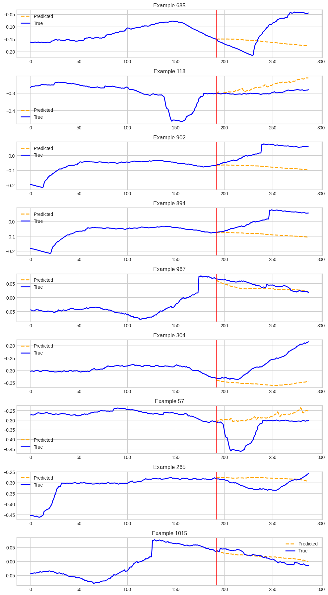
    


```python
fewshot_finetune_eval(
    dataset_name=TARGET_DATASET,
    context_length=CONTEXT_LENGTH,
    forecast_length=PREDICTION_LENGTH,
    batch_size=64,
    fewshot_percent=30,
    learning_rate=0.001,
)
```

    INFO:p-10215:t-129746807798656:get_model.py:get_model:Loading model from: ibm-granite/granite-timeseries-ttm-r2


    -------------------- Running few-shot 30% --------------------


    INFO:p-10215:t-129746807798656:get_model.py:get_model:Model loaded successfully from ibm-granite/granite-timeseries-ttm-r2, revision = main.
    INFO:p-10215:t-129746807798656:get_model.py:get_model:[TTM] context_length = 512, prediction_length = 96


    Number of params before freezing backbone 805280
    Number of params after freezing the backbone 289696
    Using learning rate = 0.001


    <div>

      <progress value='792' max='3600' style='width:300px; height:20px; vertical-align: middle;'></progress>
      [ 792/3600 00:46 < 02:46, 16.85 it/s, Epoch 11/50]
    </div>
    <table border="1" class="dataframe">
  <thead>
 <tr style="text-align: left;">
      <th>Epoch</th>
      <th>Training Loss</th>
      <th>Validation Loss</th>
    </tr>
  </thead>
  <tbody>
    <tr>
      <td>1</td>
      <td>0.350200</td>
      <td>0.650814</td>
    </tr>
    <tr>
      <td>2</td>
      <td>0.326700</td>
      <td>0.672859</td>
    </tr>
    <tr>
      <td>3</td>
      <td>0.316000</td>
      <td>0.715369</td>
    </tr>
    <tr>
      <td>4</td>
      <td>0.309900</td>
      <td>0.790489</td>
    </tr>
    <tr>
      <td>5</td>
      <td>0.305800</td>
      <td>0.794663</td>
    </tr>
    <tr>
      <td>6</td>
      <td>0.302400</td>
      <td>0.842476</td>
    </tr>
    <tr>
      <td>7</td>
      <td>0.298300</td>
      <td>0.925956</td>
    </tr>
    <tr>
      <td>8</td>
      <td>0.292900</td>
      <td>0.953116</td>
    </tr>
    <tr>
      <td>9</td>
      <td>0.289900</td>
      <td>0.958709</td>
    </tr>
    <tr>
      <td>10</td>
      <td>0.287100</td>
      <td>0.941168</td>
    </tr>
    <tr>
      <td>11</td>
      <td>0.284600</td>
      <td>1.007283</td>
    </tr>
  </tbody>
</table><p>


    [TrackingCallback] Mean Epoch Time = 3.1488582871176978 seconds, Total Train Time = 47.21740007400513
    ++++++++++++++++++++ Test MSE after few-shot 30% fine-tuning ++++++++++++++++++++


    {'eval_loss': 1.3618754148483276, 'eval_runtime': 1.0904, 'eval_samples_per_second': 1747.016, 'eval_steps_per_second': 27.512, 'epoch': 11.0}
    ++++++++++++++++++++++++++++++++++++++++++++++++++++++++++++
    (1905, 96, 25)
    (1905, 25, 8, 192)


    
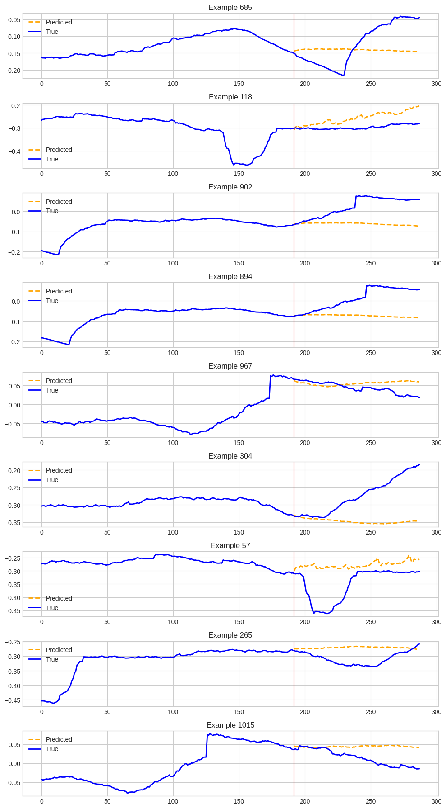
    


```python
fewshot_finetune_eval(
    dataset_name=TARGET_DATASET,
    context_length=CONTEXT_LENGTH,
    forecast_length=PREDICTION_LENGTH,
    batch_size=64,
    fewshot_percent=50,
    learning_rate=0.001,
)
```

    INFO:p-10215:t-129746807798656:get_model.py:get_model:Loading model from: ibm-granite/granite-timeseries-ttm-r2


    -------------------- Running few-shot 50% --------------------


    INFO:p-10215:t-129746807798656:get_model.py:get_model:Model loaded successfully from ibm-granite/granite-timeseries-ttm-r2, revision = main.
    INFO:p-10215:t-129746807798656:get_model.py:get_model:[TTM] context_length = 512, prediction_length = 96


    Number of params before freezing backbone 805280
    Number of params after freezing the backbone 289696
    Using learning rate = 0.001


    <div>

      <progress value='1320' max='6000' style='width:300px; height:20px; vertical-align: middle;'></progress>
      [1320/6000 01:07 < 03:58, 19.63 it/s, Epoch 11/50]
    </div>
    <table border="1" class="dataframe">
  <thead>
 <tr style="text-align: left;">
      <th>Epoch</th>
      <th>Training Loss</th>
      <th>Validation Loss</th>
    </tr>
  </thead>
  <tbody>
    <tr>
      <td>1</td>
      <td>0.360200</td>
      <td>0.662368</td>
    </tr>
    <tr>
      <td>2</td>
      <td>0.339900</td>
      <td>0.690317</td>
    </tr>
    <tr>
      <td>3</td>
      <td>0.332800</td>
      <td>0.708246</td>
    </tr>
    <tr>
      <td>4</td>
      <td>0.327500</td>
      <td>0.741260</td>
    </tr>
    <tr>
      <td>5</td>
      <td>0.322900</td>
      <td>0.769370</td>
    </tr>
    <tr>
      <td>6</td>
      <td>0.318800</td>
      <td>0.755374</td>
    </tr>
    <tr>
      <td>7</td>
      <td>0.314800</td>
      <td>0.826342</td>
    </tr>
    <tr>
      <td>8</td>
      <td>0.311800</td>
      <td>0.810062</td>
    </tr>
    <tr>
      <td>9</td>
      <td>0.308800</td>
      <td>0.823743</td>
    </tr>
    <tr>
      <td>10</td>
      <td>0.305700</td>
      <td>0.878046</td>
    </tr>
    <tr>
      <td>11</td>
      <td>0.303000</td>
      <td>0.880415</td>
    </tr>
  </tbody>
</table><p>


    [TrackingCallback] Mean Epoch Time = 5.013176722960039 seconds, Total Train Time = 67.46736598014832
    ++++++++++++++++++++ Test MSE after few-shot 50% fine-tuning ++++++++++++++++++++


    {'eval_loss': 1.3718942403793335, 'eval_runtime': 1.1344, 'eval_samples_per_second': 1679.268, 'eval_steps_per_second': 26.445, 'epoch': 11.0}
    ++++++++++++++++++++++++++++++++++++++++++++++++++++++++++++
    (1905, 96, 25)
    (1905, 25, 8, 192)


    
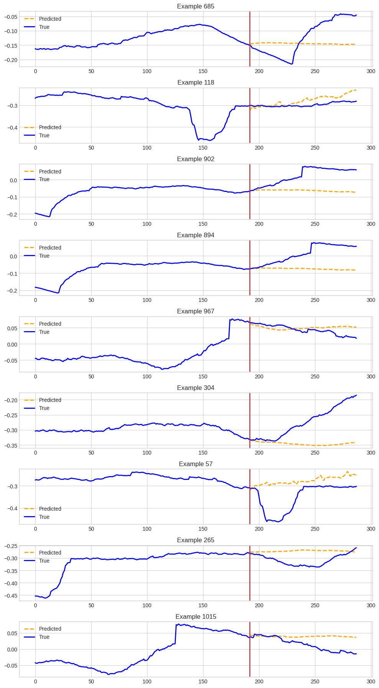
    


```python
fewshot_finetune_eval(
    dataset_name=TARGET_DATASET,
    context_length=CONTEXT_LENGTH,
    forecast_length=PREDICTION_LENGTH,
    batch_size=64,
    fewshot_percent=80,
    learning_rate=0.001,
)
```

    INFO:p-10215:t-129746807798656:get_model.py:get_model:Loading model from: ibm-granite/granite-timeseries-ttm-r2


    -------------------- Running few-shot 80% --------------------


    INFO:p-10215:t-129746807798656:get_model.py:get_model:Model loaded successfully from ibm-granite/granite-timeseries-ttm-r2, revision = main.
    INFO:p-10215:t-129746807798656:get_model.py:get_model:[TTM] context_length = 512, prediction_length = 96


    Number of params before freezing backbone 805280
    Number of params after freezing the backbone 289696
    Using learning rate = 0.001


    <div>

      <progress value='2123' max='9650' style='width:300px; height:20px; vertical-align: middle;'></progress>
      [2123/9650 01:38 < 05:51, 21.43 it/s, Epoch 11/50]
    </div>
    <table border="1" class="dataframe">
  <thead>
 <tr style="text-align: left;">
      <th>Epoch</th>
      <th>Training Loss</th>
      <th>Validation Loss</th>
    </tr>
  </thead>
  <tbody>
    <tr>
      <td>1</td>
      <td>0.346500</td>
      <td>0.652420</td>
    </tr>
    <tr>
      <td>2</td>
      <td>0.328800</td>
      <td>0.667871</td>
    </tr>
    <tr>
      <td>3</td>
      <td>0.323200</td>
      <td>0.676204</td>
    </tr>
    <tr>
      <td>4</td>
      <td>0.318400</td>
      <td>0.728485</td>
    </tr>
    <tr>
      <td>5</td>
      <td>0.315600</td>
      <td>0.752423</td>
    </tr>
    <tr>
      <td>6</td>
      <td>0.311100</td>
      <td>0.746430</td>
    </tr>
    <tr>
      <td>7</td>
      <td>0.308200</td>
      <td>0.758588</td>
    </tr>
    <tr>
      <td>8</td>
      <td>0.305300</td>
      <td>0.740659</td>
    </tr>
    <tr>
      <td>9</td>
      <td>0.303500</td>
      <td>0.762113</td>
    </tr>
    <tr>
      <td>10</td>
      <td>0.301900</td>
      <td>0.737513</td>
    </tr>
    <tr>
      <td>11</td>
      <td>0.299900</td>
      <td>0.759457</td>
    </tr>
  </tbody>
</table><p>


    [TrackingCallback] Mean Epoch Time = 7.932208342985674 seconds, Total Train Time = 99.3136818408966
    ++++++++++++++++++++ Test MSE after few-shot 80% fine-tuning ++++++++++++++++++++


    {'eval_loss': 1.3597569465637207, 'eval_runtime': 1.1567, 'eval_samples_per_second': 1646.918, 'eval_steps_per_second': 25.936, 'epoch': 11.0}
    ++++++++++++++++++++++++++++++++++++++++++++++++++++++++++++
    (1905, 96, 25)
    (1905, 25, 8, 192)


    

    


```python
def fewshot_finetune_eval(
    dataset_name,
    batch_size,
    learning_rate=None,
    context_length=512,
    forecast_length=96,
    fewshot_percent=5,
    freeze_backbone=False,
    num_epochs=50,
    save_dir=OUT_DIR,
    loss="mse",
    quantile=0.5,
):
    out_dir = os.path.join(save_dir, dataset_name)

    print("-" * 20, f"Running few-shot {fewshot_percent}%", "-" * 20)

    # Data prep: Get dataset

    tsp = TimeSeriesPreprocessor(
        **column_specifiers,
        context_length=context_length,
        prediction_length=forecast_length,
        scaling=True,
        encode_categorical=False,
        scaler_type="standard",
    )

    # change head dropout to 0.7 for ett datasets
    if "ett" in dataset_name:
        finetune_forecast_model = get_model(
            TTM_MODEL_PATH,
            context_length=context_length,
            prediction_length=forecast_length,
            freq_prefix_tuning=False,
            freq=None,
            prefer_l1_loss=False,
            prefer_longer_context=True,
            # Can also provide TTM Config args
            head_dropout=0.7,
            loss=loss,
            quantile=quantile,
        )
    else:
        finetune_forecast_model = get_model(
            TTM_MODEL_PATH,
            context_length=context_length,
            prediction_length=forecast_length,
            freq_prefix_tuning=False,
            freq=None,
            prefer_l1_loss=False,
            prefer_longer_context=True,
            # Can also provide TTM Config args
            loss=loss,
            quantile=quantile,
        )

    dset_train, dset_val, dset_test = get_datasets(
        tsp,
        data,
        split_config,
        fewshot_fraction=fewshot_percent / 100,
        fewshot_location="first",
        use_frequency_token=finetune_forecast_model.config.resolution_prefix_tuning,
    )

    if freeze_backbone:
        print(
            "Number of params before freezing backbone",
            count_parameters(finetune_forecast_model),
        )

        # Freeze the backbone of the model
        for param in finetune_forecast_model.backbone.parameters():
            param.requires_grad = False

        # Count params
        print(
            "Number of params after freezing the backbone",
            count_parameters(finetune_forecast_model),
        )

    # Find optimal learning rate
    # Use with caution: Set it manually if the suggested learning rate is not suitable
    if learning_rate is None:
        learning_rate, finetune_forecast_model = optimal_lr_finder(
            finetune_forecast_model,
            dset_train,
            batch_size=batch_size,
        )
        print("OPTIMAL SUGGESTED LEARNING RATE =", learning_rate)

    print(f"Using learning rate = {learning_rate}")
    finetune_forecast_args = TrainingArguments(
        output_dir=os.path.join(out_dir, "output"),
        overwrite_output_dir=True,
        learning_rate=learning_rate,
        num_train_epochs=num_epochs,
        do_eval=True,
        evaluation_strategy="epoch",
        per_device_train_batch_size=batch_size,
        per_device_eval_batch_size=batch_size,
        dataloader_num_workers=8,
        report_to="none",
        save_strategy="epoch",
        logging_strategy="epoch",
        save_total_limit=1,
        logging_dir=os.path.join(out_dir, "logs"),  # Make sure to specify a logging directory
        load_best_model_at_end=True,  # Load the best model when training ends
        metric_for_best_model="eval_loss",  # Metric to monitor for early stopping
        greater_is_better=False,  # For loss
        seed=SEED,
    )

    # Create the early stopping callback
    early_stopping_callback = EarlyStoppingCallback(
        early_stopping_patience=10,  # Number of epochs with no improvement after which to stop
        early_stopping_threshold=1e-5,  # Minimum improvement required to consider as improvement
    )
    tracking_callback = TrackingCallback()

    # Optimizer and scheduler
    optimizer = AdamW(finetune_forecast_model.parameters(), lr=learning_rate)
    scheduler = OneCycleLR(
        optimizer,
        learning_rate,
        epochs=num_epochs,
        steps_per_epoch=math.ceil(len(dset_train) / (batch_size)),
    )

    finetune_forecast_trainer = Trainer(
        model=finetune_forecast_model,
        args=finetune_forecast_args,
        train_dataset=dset_train,
        eval_dataset=dset_val,
        callbacks=[early_stopping_callback, tracking_callback],
        optimizers=(optimizer, scheduler),
    )
    finetune_forecast_trainer.remove_callback(INTEGRATION_TO_CALLBACK["codecarbon"])

    # Fine tune
    finetune_forecast_trainer.train()

    # Evaluation
    print("+" * 20, f"Test MSE after few-shot {fewshot_percent}% fine-tuning", "+" * 20)

    finetune_forecast_trainer.model.loss = "mse"  # fixing metric to mse for evaluation

    fewshot_output = finetune_forecast_trainer.evaluate(dset_test)
    print(fewshot_output)
    print("+" * 60)

    # get predictions

    predictions_dict = finetune_forecast_trainer.predict(dset_test)

    predictions_np = predictions_dict.predictions[0]

    print(predictions_np.shape)

    # get backbone embeddings (if needed for further analysis)

    backbone_embedding = predictions_dict.predictions[1]

    print(backbone_embedding.shape)

    # plot
    plot_predictions(
        model=finetune_forecast_trainer.model,
        dset=dset_test,
        plot_dir=os.path.join(OUT_DIR, dataset_name),
        plot_prefix="test_fewshot",
        indices=[685, 118, 902, 894, 967, 304, 57, 265, 1015],
        channel=0,
    )

    predictions_dict = finetune_forecast_trainer.predict(dset_test)

    # Extract predictions
    if isinstance(predictions_dict.predictions, (list, tuple)) and len(predictions_dict.predictions) >= 1:
        preds = predictions_dict.predictions[0]
        if isinstance(preds, torch.Tensor):
            preds = preds.detach().cpu().numpy()
    else:
        raise ValueError("No predictions found!")

    # Extract targets
    first_sample = dset_test[0]
    if isinstance(first_sample, dict):
        targets = torch.stack([sample["future_values"] for sample in dset_test])
    elif isinstance(first_sample, (tuple, list)) and len(first_sample) > 1:
        targets = torch.stack([sample[1] for sample in dset_test])
    else:
        raise ValueError("Unexpected sample format.")

    if isinstance(targets, torch.Tensor):
        targets = targets.detach().cpu().numpy()

    print(f"[Debug] preds shape: {preds.shape}, targets shape: {targets.shape}")

    return preds, targets

```


```python
fewshot_finetune_eval(
    dataset_name=TARGET_DATASET,
    context_length=CONTEXT_LENGTH,
    forecast_length=PREDICTION_LENGTH,
    batch_size=64,
    fewshot_percent=5,
    learning_rate=0.001,
)
```

    INFO:p-10215:t-129746807798656:get_model.py:get_model:Loading model from: ibm-granite/granite-timeseries-ttm-r2


    -------------------- Running few-shot 5% --------------------


    INFO:p-10215:t-129746807798656:get_model.py:get_model:Model loaded successfully from ibm-granite/granite-timeseries-ttm-r2, revision = main.
    INFO:p-10215:t-129746807798656:get_model.py:get_model:[TTM] context_length = 512, prediction_length = 96


    Using learning rate = 0.001


    <div>

      <progress value='121' max='550' style='width:300px; height:20px; vertical-align: middle;'></progress>
      [121/550 00:23 < 01:23, 5.14 it/s, Epoch 11/50]
    </div>
    <table border="1" class="dataframe">
  <thead>
 <tr style="text-align: left;">
      <th>Epoch</th>
      <th>Training Loss</th>
      <th>Validation Loss</th>
    </tr>
  </thead>
  <tbody>
    <tr>
      <td>1</td>
      <td>0.302900</td>
      <td>0.693554</td>
    </tr>
    <tr>
      <td>2</td>
      <td>0.272600</td>
      <td>0.709894</td>
    </tr>
    <tr>
      <td>3</td>
      <td>0.259700</td>
      <td>0.780471</td>
    </tr>
    <tr>
      <td>4</td>
      <td>0.247100</td>
      <td>0.820934</td>
    </tr>
    <tr>
      <td>5</td>
      <td>0.235600</td>
      <td>0.868448</td>
    </tr>
    <tr>
      <td>6</td>
      <td>0.226600</td>
      <td>0.871898</td>
    </tr>
    <tr>
      <td>7</td>
      <td>0.214300</td>
      <td>0.940491</td>
    </tr>
    <tr>
      <td>8</td>
      <td>0.205700</td>
      <td>1.001714</td>
    </tr>
    <tr>
      <td>9</td>
      <td>0.194800</td>
      <td>1.020099</td>
    </tr>
    <tr>
      <td>10</td>
      <td>0.186100</td>
      <td>0.988844</td>
    </tr>
    <tr>
      <td>11</td>
      <td>0.174600</td>
      <td>0.985646</td>
    </tr>
  </tbody>
</table><p>


    [TrackingCallback] Mean Epoch Time = 1.0725288391113281 seconds, Total Train Time = 23.51857018470764
    ++++++++++++++++++++ Test MSE after few-shot 5% fine-tuning ++++++++++++++++++++


    {'eval_loss': 1.380488634109497, 'eval_runtime': 1.1076, 'eval_samples_per_second': 1719.994, 'eval_steps_per_second': 27.087, 'epoch': 11.0}
    ++++++++++++++++++++++++++++++++++++++++++++++++++++++++++++
    (1905, 96, 25)
    (1905, 25, 8, 192)


    

    


```python
fewshot_finetune_eval(
    dataset_name=TARGET_DATASET,
    context_length=CONTEXT_LENGTH,
    forecast_length=PREDICTION_LENGTH,
    batch_size=64,
    fewshot_percent=30,
    learning_rate=0.001,
)
```

    INFO:p-10215:t-129746807798656:get_model.py:get_model:Loading model from: ibm-granite/granite-timeseries-ttm-r2


    -------------------- Running few-shot 30% --------------------


    INFO:p-10215:t-129746807798656:get_model.py:get_model:Model loaded successfully from ibm-granite/granite-timeseries-ttm-r2, revision = main.
    INFO:p-10215:t-129746807798656:get_model.py:get_model:[TTM] context_length = 512, prediction_length = 96


    Using learning rate = 0.001


    <div>

      <progress value='792' max='3600' style='width:300px; height:20px; vertical-align: middle;'></progress>
      [ 792/3600 01:11 < 04:15, 11.00 it/s, Epoch 11/50]
    </div>
    <table border="1" class="dataframe">
  <thead>
 <tr style="text-align: left;">
      <th>Epoch</th>
      <th>Training Loss</th>
      <th>Validation Loss</th>
    </tr>
  </thead>
  <tbody>
    <tr>
      <td>1</td>
      <td>0.331600</td>
      <td>0.707571</td>
    </tr>
    <tr>
      <td>2</td>
      <td>0.312500</td>
      <td>0.766075</td>
    </tr>
    <tr>
      <td>3</td>
      <td>0.302200</td>
      <td>0.805462</td>
    </tr>
    <tr>
      <td>4</td>
      <td>0.295200</td>
      <td>0.882717</td>
    </tr>
    <tr>
      <td>5</td>
      <td>0.287900</td>
      <td>0.887345</td>
    </tr>
    <tr>
      <td>6</td>
      <td>0.282000</td>
      <td>0.828111</td>
    </tr>
    <tr>
      <td>7</td>
      <td>0.271300</td>
      <td>0.877866</td>
    </tr>
    <tr>
      <td>8</td>
      <td>0.262700</td>
      <td>0.875898</td>
    </tr>
    <tr>
      <td>9</td>
      <td>0.256500</td>
      <td>0.893999</td>
    </tr>
    <tr>
      <td>10</td>
      <td>0.247600</td>
      <td>0.812792</td>
    </tr>
    <tr>
      <td>11</td>
      <td>0.241200</td>
      <td>0.888496</td>
    </tr>
  </tbody>
</table><p>


    [TrackingCallback] Mean Epoch Time = 5.462517608295787 seconds, Total Train Time = 72.20839309692383
    ++++++++++++++++++++ Test MSE after few-shot 30% fine-tuning ++++++++++++++++++++


    {'eval_loss': 1.396354079246521, 'eval_runtime': 1.1768, 'eval_samples_per_second': 1618.764, 'eval_steps_per_second': 25.492, 'epoch': 11.0}
    ++++++++++++++++++++++++++++++++++++++++++++++++++++++++++++
    (1905, 96, 25)
    (1905, 25, 8, 192)


    
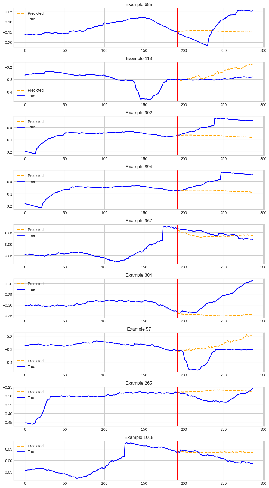
    


# Fewshot with quantile loss (We can use pinball loss to generate different quantiles as required)


```python

```


```python
fewshot_finetune_eval(
    dataset_name=TARGET_DATASET,
    context_length=CONTEXT_LENGTH,
    forecast_length=PREDICTION_LENGTH,
    batch_size=64,
    fewshot_percent=50,
    learning_rate=0.001,
)
```

    INFO:p-10215:t-129746807798656:get_model.py:get_model:Loading model from: ibm-granite/granite-timeseries-ttm-r2


    -------------------- Running few-shot 50% --------------------


    INFO:p-10215:t-129746807798656:get_model.py:get_model:Model loaded successfully from ibm-granite/granite-timeseries-ttm-r2, revision = main.
    INFO:p-10215:t-129746807798656:get_model.py:get_model:[TTM] context_length = 512, prediction_length = 96


    Using learning rate = 0.001


    <div>

      <progress value='1320' max='6000' style='width:300px; height:20px; vertical-align: middle;'></progress>
      [1320/6000 01:49 < 06:30, 11.98 it/s, Epoch 11/50]
    </div>
    <table border="1" class="dataframe">
  <thead>
 <tr style="text-align: left;">
      <th>Epoch</th>
      <th>Training Loss</th>
      <th>Validation Loss</th>
    </tr>
  </thead>
  <tbody>
    <tr>
      <td>1</td>
      <td>0.344700</td>
      <td>0.720965</td>
    </tr>
    <tr>
      <td>2</td>
      <td>0.328000</td>
      <td>0.748271</td>
    </tr>
    <tr>
      <td>3</td>
      <td>0.320300</td>
      <td>0.782979</td>
    </tr>
    <tr>
      <td>4</td>
      <td>0.313500</td>
      <td>0.830302</td>
    </tr>
    <tr>
      <td>5</td>
      <td>0.305800</td>
      <td>0.830480</td>
    </tr>
    <tr>
      <td>6</td>
      <td>0.297600</td>
      <td>0.827806</td>
    </tr>
    <tr>
      <td>7</td>
      <td>0.289400</td>
      <td>0.930539</td>
    </tr>
    <tr>
      <td>8</td>
      <td>0.282100</td>
      <td>0.839970</td>
    </tr>
    <tr>
      <td>9</td>
      <td>0.275600</td>
      <td>0.871480</td>
    </tr>
    <tr>
      <td>10</td>
      <td>0.268500</td>
      <td>0.882710</td>
    </tr>
    <tr>
      <td>11</td>
      <td>0.261100</td>
      <td>0.950282</td>
    </tr>
  </tbody>
</table><p>


    [TrackingCallback] Mean Epoch Time = 8.94044303894043 seconds, Total Train Time = 110.33849096298218
    ++++++++++++++++++++ Test MSE after few-shot 50% fine-tuning ++++++++++++++++++++


    {'eval_loss': 1.4387069940567017, 'eval_runtime': 1.0302, 'eval_samples_per_second': 1849.094, 'eval_steps_per_second': 29.12, 'epoch': 11.0}
    ++++++++++++++++++++++++++++++++++++++++++++++++++++++++++++
    (1905, 96, 25)
    (1905, 25, 8, 192)


    
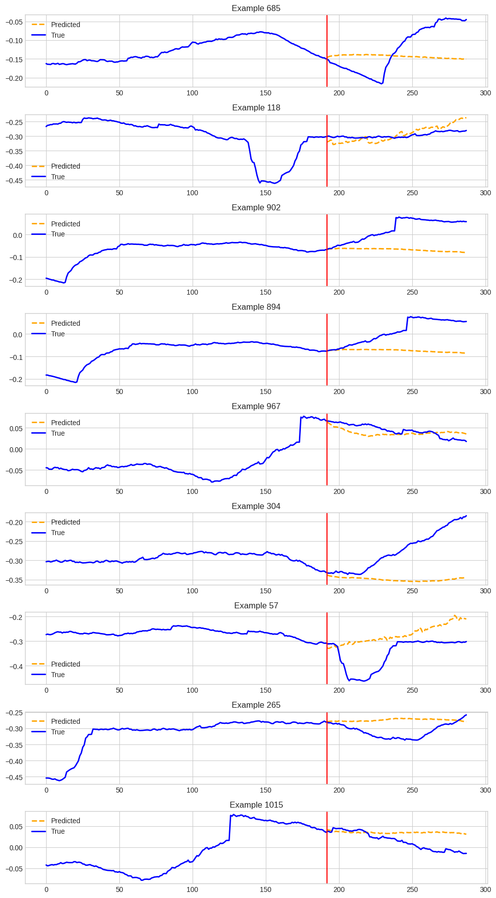
    


```python
fewshot_finetune_eval(
    dataset_name=TARGET_DATASET,
    context_length=CONTEXT_LENGTH,
    forecast_length=PREDICTION_LENGTH,
    batch_size=64,
    fewshot_percent=80,
    learning_rate=0.001,
)
```

    INFO:p-10215:t-129746807798656:get_model.py:get_model:Loading model from: ibm-granite/granite-timeseries-ttm-r2


    -------------------- Running few-shot 80% --------------------


    INFO:p-10215:t-129746807798656:get_model.py:get_model:Model loaded successfully from ibm-granite/granite-timeseries-ttm-r2, revision = main.
    INFO:p-10215:t-129746807798656:get_model.py:get_model:[TTM] context_length = 512, prediction_length = 96


    Using learning rate = 0.001


    <div>

      <progress value='4053' max='9650' style='width:300px; height:20px; vertical-align: middle;'></progress>
      [4053/9650 05:40 < 07:49, 11.91 it/s, Epoch 21/50]
    </div>
    <table border="1" class="dataframe">
  <thead>
 <tr style="text-align: left;">
      <th>Epoch</th>
      <th>Training Loss</th>
      <th>Validation Loss</th>
    </tr>
  </thead>
  <tbody>
    <tr>
      <td>1</td>
      <td>0.334100</td>
      <td>0.705871</td>
    </tr>
    <tr>
      <td>2</td>
      <td>0.318900</td>
      <td>0.711005</td>
    </tr>
    <tr>
      <td>3</td>
      <td>0.312400</td>
      <td>0.719965</td>
    </tr>
    <tr>
      <td>4</td>
      <td>0.306000</td>
      <td>0.691556</td>
    </tr>
    <tr>
      <td>5</td>
      <td>0.300200</td>
      <td>0.688891</td>
    </tr>
    <tr>
      <td>6</td>
      <td>0.293800</td>
      <td>0.714133</td>
    </tr>
    <tr>
      <td>7</td>
      <td>0.287000</td>
      <td>0.740398</td>
    </tr>
    <tr>
      <td>8</td>
      <td>0.281100</td>
      <td>0.769230</td>
    </tr>
    <tr>
      <td>9</td>
      <td>0.274100</td>
      <td>0.744992</td>
    </tr>
    <tr>
      <td>10</td>
      <td>0.269100</td>
      <td>0.762432</td>
    </tr>
    <tr>
      <td>11</td>
      <td>0.262800</td>
      <td>0.681438</td>
    </tr>
    <tr>
      <td>12</td>
      <td>0.259700</td>
      <td>0.682518</td>
    </tr>
    <tr>
      <td>13</td>
      <td>0.254700</td>
      <td>0.755758</td>
    </tr>
    <tr>
      <td>14</td>
      <td>0.251700</td>
      <td>0.815473</td>
    </tr>
    <tr>
      <td>15</td>
      <td>0.248600</td>
      <td>0.777920</td>
    </tr>
    <tr>
      <td>16</td>
      <td>0.243700</td>
      <td>0.733429</td>
    </tr>
    <tr>
      <td>17</td>
      <td>0.240800</td>
      <td>0.772251</td>
    </tr>
    <tr>
      <td>18</td>
      <td>0.238400</td>
      <td>0.762202</td>
    </tr>
    <tr>
      <td>19</td>
      <td>0.235800</td>
      <td>0.814632</td>
    </tr>
    <tr>
      <td>20</td>
      <td>0.234500</td>
      <td>0.840454</td>
    </tr>
    <tr>
      <td>21</td>
      <td>0.231100</td>
      <td>0.836458</td>
    </tr>
  </tbody>
</table><p>


    [TrackingCallback] Mean Epoch Time = 14.945850962684268 seconds, Total Train Time = 340.4468593597412
    ++++++++++++++++++++ Test MSE after few-shot 80% fine-tuning ++++++++++++++++++++


    {'eval_loss': 1.388822078704834, 'eval_runtime': 1.3109, 'eval_samples_per_second': 1453.23, 'eval_steps_per_second': 22.886, 'epoch': 21.0}
    ++++++++++++++++++++++++++++++++++++++++++++++++++++++++++++
    (1905, 96, 25)
    (1905, 25, 8, 192)


    
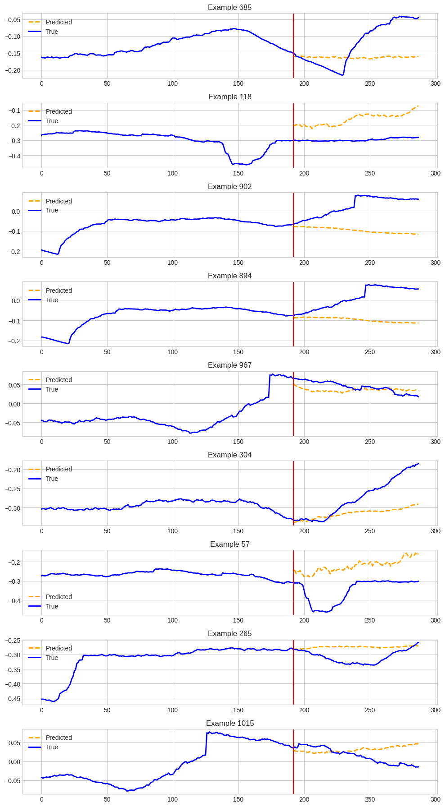
    


# Fewshot with quantile loss (We can use pinball loss to generate different quantiles as required)


```python
fewshot_finetune_eval(
    dataset_name=TARGET_DATASET,
    context_length=CONTEXT_LENGTH,
    forecast_length=PREDICTION_LENGTH,
    batch_size=64,
    fewshot_percent=5,
    learning_rate=0.001,
    loss="pinball",
    quantile=0.5,
)
```

    INFO:p-10215:t-129746807798656:get_model.py:get_model:Loading model from: ibm-granite/granite-timeseries-ttm-r2


    -------------------- Running few-shot 5% --------------------


    INFO:p-10215:t-129746807798656:get_model.py:get_model:Model loaded successfully from ibm-granite/granite-timeseries-ttm-r2, revision = main.
    INFO:p-10215:t-129746807798656:get_model.py:get_model:[TTM] context_length = 512, prediction_length = 96


    Using learning rate = 0.001


    <div>

      <progress value='132' max='550' style='width:300px; height:20px; vertical-align: middle;'></progress>
      [132/550 00:25 < 01:22, 5.08 it/s, Epoch 12/50]
    </div>
    <table border="1" class="dataframe">
  <thead>
 <tr style="text-align: left;">
      <th>Epoch</th>
      <th>Training Loss</th>
      <th>Validation Loss</th>
    </tr>
  </thead>
  <tbody>
    <tr>
      <td>1</td>
      <td>0.184600</td>
      <td>0.245172</td>
    </tr>
    <tr>
      <td>2</td>
      <td>0.173300</td>
      <td>0.244747</td>
    </tr>
    <tr>
      <td>3</td>
      <td>0.168700</td>
      <td>0.248929</td>
    </tr>
    <tr>
      <td>4</td>
      <td>0.164100</td>
      <td>0.248900</td>
    </tr>
    <tr>
      <td>5</td>
      <td>0.160000</td>
      <td>0.251743</td>
    </tr>
    <tr>
      <td>6</td>
      <td>0.157000</td>
      <td>0.254978</td>
    </tr>
    <tr>
      <td>7</td>
      <td>0.152800</td>
      <td>0.261856</td>
    </tr>
    <tr>
      <td>8</td>
      <td>0.150400</td>
      <td>0.267621</td>
    </tr>
    <tr>
      <td>9</td>
      <td>0.146000</td>
      <td>0.267781</td>
    </tr>
    <tr>
      <td>10</td>
      <td>0.143300</td>
      <td>0.261790</td>
    </tr>
    <tr>
      <td>11</td>
      <td>0.140100</td>
      <td>0.264896</td>
    </tr>
    <tr>
      <td>12</td>
      <td>0.137500</td>
      <td>0.271037</td>
    </tr>
  </tbody>
</table><p>


    [TrackingCallback] Mean Epoch Time = 1.0648563901583354 seconds, Total Train Time = 25.97574234008789
    ++++++++++++++++++++ Test MSE after few-shot 5% fine-tuning ++++++++++++++++++++


    {'eval_loss': 1.3819373846054077, 'eval_runtime': 1.0556, 'eval_samples_per_second': 1804.718, 'eval_steps_per_second': 28.421, 'epoch': 12.0}
    ++++++++++++++++++++++++++++++++++++++++++++++++++++++++++++
    (1905, 96, 25)
    (1905, 25, 8, 192)


    
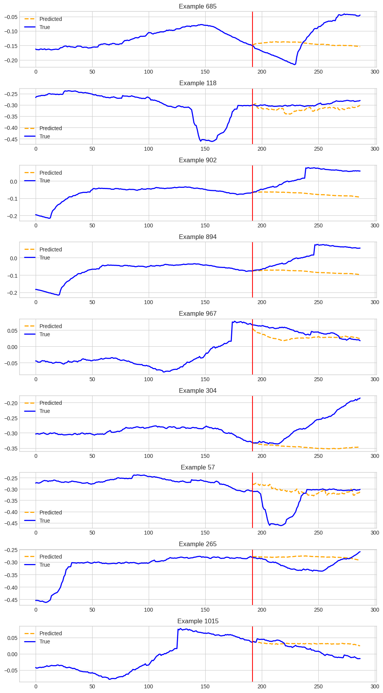
    


## Example: TTM for other forecast horizon lengths and context lengths

The minimum / maximum supported context length for the Granite-TTM-R2 models are 52 and 1536 respectively. Whereas the maximum supported prediction length for Granite-TTM-R2 is 720. (For other models, see the respective model cards) 

However, we can ask for a different context length or forecast length, and the `get_model()` utility will choose the closest possible TTM from the model suite. We have to make sure that the required context and prediction lengths are passed to the `TimeSeriesPreprocessor()` so that the data batches are generated correctly. In this notebook, this is handled in the `zeroshot_eval()` and `fewshot_finetune_eval()` functions.

### Zero-shot


```python
zeroshot_eval(dataset_name=TARGET_DATASET, context_length=1024, forecast_length=48, batch_size=64)
```

    INFO:p-10215:t-129746807798656:get_model.py:get_model:Loading model from: ibm-granite/granite-timeseries-ttm-r2
    WARNING:p-10215:t-129746807798656:get_model.py:get_model:Requested `prediction_length` (48) is not exactly equal to any of the available TTM prediction lengths. Hence, TTM will forecast using the `prediction_filter_length` argument to provide the requested prediction length. Check the model card to know more about the supported context lengths and forecast/prediction lengths.
    INFO:p-10215:t-129746807798656:get_model.py:get_model:Model loaded successfully from ibm-granite/granite-timeseries-ttm-r2, revision = 1024-96-r2.
    INFO:p-10215:t-129746807798656:get_model.py:get_model:[TTM] context_length = 1024, prediction_length = 96


    ++++++++++++++++++++ Test MSE zero-shot ++++++++++++++++++++


    {'eval_loss': 0.8318035006523132, 'eval_runtime': 2.51, 'eval_samples_per_second': 778.092, 'eval_steps_per_second': 12.351}
    (1953, 48, 25)
    (1953, 25, 8, 384)


    
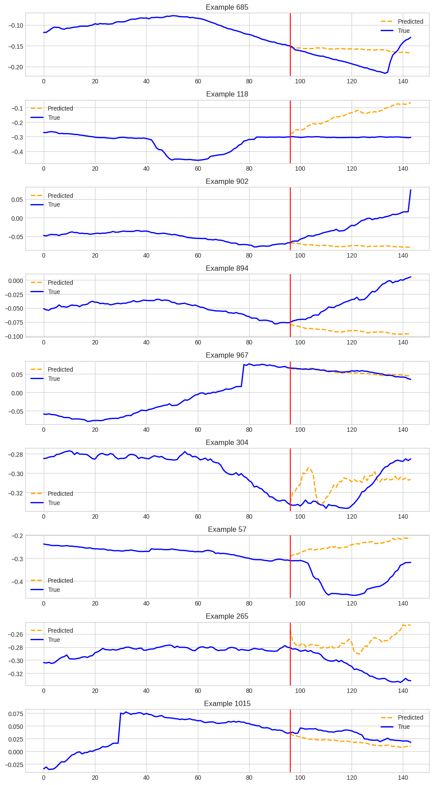
    


### Few-shot 5%


```python
fewshot_finetune_eval(
    dataset_name=TARGET_DATASET,
    context_length=1536,
    forecast_length=48,
    batch_size=64,
    fewshot_percent=5,
    learning_rate=None,
)
```

    INFO:p-10215:t-129746807798656:get_model.py:get_model:Loading model from: ibm-granite/granite-timeseries-ttm-r2
    WARNING:p-10215:t-129746807798656:get_model.py:get_model:Requested `prediction_length` (48) is not exactly equal to any of the available TTM prediction lengths. Hence, TTM will forecast using the `prediction_filter_length` argument to provide the requested prediction length. Check the model card to know more about the supported context lengths and forecast/prediction lengths.


    -------------------- Running few-shot 5% --------------------


    INFO:p-10215:t-129746807798656:get_model.py:get_model:Model loaded successfully from ibm-granite/granite-timeseries-ttm-r2, revision = 1536-96-r2.
    INFO:p-10215:t-129746807798656:get_model.py:get_model:[TTM] context_length = 1536, prediction_length = 96
    INFO:p-10215:t-129746807798656:lr_finder.py:optimal_lr_finder:LR Finder: Running learning rate (LR) finder algorithm. If the suggested LR is very low, we suggest setting the LR manually.
    INFO:p-10215:t-129746807798656:lr_finder.py:optimal_lr_finder:LR Finder: Using GPU:0.
    INFO:p-10215:t-129746807798656:lr_finder.py:optimal_lr_finder:LR Finder: Suggested learning rate = 9.770099572992256e-05


    OPTIMAL SUGGESTED LEARNING RATE = 9.770099572992256e-05
    Using learning rate = 9.770099572992256e-05


    <div>

      <progress value='121' max='550' style='width:300px; height:20px; vertical-align: middle;'></progress>
      [121/550 01:11 < 04:18, 1.66 it/s, Epoch 11/50]
    </div>
    <table border="1" class="dataframe">
  <thead>
 <tr style="text-align: left;">
      <th>Epoch</th>
      <th>Training Loss</th>
      <th>Validation Loss</th>
    </tr>
  </thead>
  <tbody>
    <tr>
      <td>1</td>
      <td>0.244400</td>
      <td>0.425829</td>
    </tr>
    <tr>
      <td>2</td>
      <td>0.238000</td>
      <td>0.427347</td>
    </tr>
    <tr>
      <td>3</td>
      <td>0.232500</td>
      <td>0.429767</td>
    </tr>
    <tr>
      <td>4</td>
      <td>0.229600</td>
      <td>0.434295</td>
    </tr>
    <tr>
      <td>5</td>
      <td>0.224800</td>
      <td>0.438778</td>
    </tr>
    <tr>
      <td>6</td>
      <td>0.217800</td>
      <td>0.443470</td>
    </tr>
    <tr>
      <td>7</td>
      <td>0.211600</td>
      <td>0.448849</td>
    </tr>
    <tr>
      <td>8</td>
      <td>0.204700</td>
      <td>0.450860</td>
    </tr>
    <tr>
      <td>9</td>
      <td>0.197600</td>
      <td>0.453312</td>
    </tr>
    <tr>
      <td>10</td>
      <td>0.190600</td>
      <td>0.459368</td>
    </tr>
    <tr>
      <td>11</td>
      <td>0.181900</td>
      <td>0.463863</td>
    </tr>
  </tbody>
</table><p>


    Checkpoint destination directory ttm_finetuned_models/PSM/output/checkpoint-22 already exists and is non-empty. Saving will proceed but saved results may be invalid.


    [TrackingCallback] Mean Epoch Time = 3.392817735671997 seconds, Total Train Time = 72.43065190315247
    ++++++++++++++++++++ Test MSE after few-shot 5% fine-tuning ++++++++++++++++++++


    {'eval_loss': 0.8606430292129517, 'eval_runtime': 3.2019, 'eval_samples_per_second': 609.953, 'eval_steps_per_second': 9.682, 'epoch': 11.0}
    ++++++++++++++++++++++++++++++++++++++++++++++++++++++++++++
    (1953, 48, 25)
    (1953, 25, 12, 384)


    
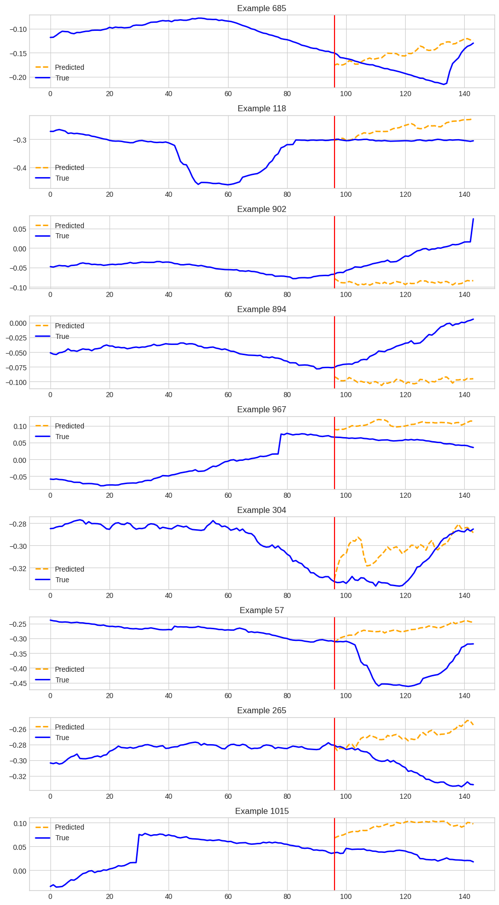
    


```python
fewshot_finetune_eval(
    dataset_name=TARGET_DATASET,
    context_length=CONTEXT_LENGTH,
    forecast_length=PREDICTION_LENGTH,
    batch_size=64,
    fewshot_percent=50,
    learning_rate=0.001,
)
```

    INFO:p-30167:t-129979547536256:get_model.py:get_model:Loading model from: ibm-granite/granite-timeseries-ttm-r2


    -------------------- Running few-shot 50% --------------------


    INFO:p-30167:t-129979547536256:get_model.py:get_model:Model loaded successfully from ibm-granite/granite-timeseries-ttm-r2, revision = main.
    INFO:p-30167:t-129979547536256:get_model.py:get_model:[TTM] context_length = 512, prediction_length = 96


    Using learning rate = 0.001


    <div>

      <progress value='1320' max='6000' style='width:300px; height:20px; vertical-align: middle;'></progress>
      [1320/6000 27:42 < 1:38:21, 0.79 it/s, Epoch 11/50]
    </div>
    <table border="1" class="dataframe">
  <thead>
 <tr style="text-align: left;">
      <th>Epoch</th>
      <th>Training Loss</th>
      <th>Validation Loss</th>
    </tr>
  </thead>
  <tbody>
    <tr>
      <td>1</td>
      <td>0.345200</td>
      <td>0.717732</td>
    </tr>
    <tr>
      <td>2</td>
      <td>0.327900</td>
      <td>0.747335</td>
    </tr>
    <tr>
      <td>3</td>
      <td>0.321200</td>
      <td>0.773693</td>
    </tr>
    <tr>
      <td>4</td>
      <td>0.313800</td>
      <td>0.827635</td>
    </tr>
    <tr>
      <td>5</td>
      <td>0.306000</td>
      <td>0.836690</td>
    </tr>
    <tr>
      <td>6</td>
      <td>0.297400</td>
      <td>0.837269</td>
    </tr>
    <tr>
      <td>7</td>
      <td>0.289500</td>
      <td>1.034753</td>
    </tr>
    <tr>
      <td>8</td>
      <td>0.282400</td>
      <td>0.855861</td>
    </tr>
    <tr>
      <td>9</td>
      <td>0.274000</td>
      <td>0.884904</td>
    </tr>
    <tr>
      <td>10</td>
      <td>0.268500</td>
      <td>0.864832</td>
    </tr>
    <tr>
      <td>11</td>
      <td>0.261700</td>
      <td>0.930972</td>
    </tr>
  </tbody>
</table><p>


    Checkpoint destination directory ttm_finetuned_models/PSM/output/checkpoint-120 already exists and is non-empty. Saving will proceed but saved results may be invalid.


    [TrackingCallback] Mean Epoch Time = 140.82328675009987 seconds, Total Train Time = 1663.686109304428
    ++++++++++++++++++++ Test MSE after few-shot 50% fine-tuning ++++++++++++++++++++


    {'eval_loss': 1.4327971935272217, 'eval_runtime': 10.1039, 'eval_samples_per_second': 188.542, 'eval_steps_per_second': 2.969, 'epoch': 11.0}
    ++++++++++++++++++++++++++++++++++++++++++++++++++++++++++++
    (1905, 96, 25)
    (1905, 25, 8, 192)


    [Debug] preds shape: (1905, 96, 25), targets shape: (1905, 96, 25)


    (array([[[-0.28601182, -2.8939977 , -1.2315648 , ..., -0.6292438 ,
               1.242158  , -1.27527   ],
             [-0.29849875, -2.9452555 , -1.2484536 , ..., -0.6537205 ,
               1.261894  , -1.1882457 ],
             [-0.3149346 , -3.0097542 , -1.2698176 , ..., -0.6470466 ,
               1.3034549 , -1.1361676 ],
             ...,
             [-0.2609437 , -2.7878108 , -1.2147174 , ..., -0.4887278 ,
               1.2368189 , -1.0957289 ],
             [-0.2622838 , -2.7910047 , -1.2196995 , ..., -0.5333335 ,
               1.1977643 , -1.1011896 ],
             [-0.2615965 , -2.7880664 , -1.2229915 , ..., -0.54205734,
               1.1672645 , -1.1372905 ]],
     
            [[-0.28585336, -2.888113  , -1.2373854 , ..., -0.7604603 ,
               0.9162383 , -1.1968669 ],
             [-0.31390494, -2.9936795 , -1.2766061 , ..., -0.7214993 ,
               0.9896654 , -1.1336926 ],
             [-0.3142332 , -3.0019472 , -1.2935609 , ..., -0.7165513 ,
               0.96541274, -1.1403822 ],
             ...,
             [-0.2593646 , -2.7747817 , -1.2223022 , ..., -0.5092045 ,
               1.0558491 , -1.0360551 ],
             [-0.2588448 , -2.7713902 , -1.2296576 , ..., -0.51968306,
               0.98945916, -1.0696443 ],
             [-0.25706032, -2.7655282 , -1.2274671 , ..., -0.56516117,
               0.94516516, -1.0427467 ]],
     
            [[-0.29906052, -2.9348426 , -1.2413945 , ..., -0.6567624 ,
               0.9095539 , -1.2492969 ],
             [-0.31204665, -2.986443  , -1.2820826 , ..., -0.6675589 ,
               0.90138257, -1.2392126 ],
             [-0.3081944 , -2.980607  , -1.282857  , ..., -0.66777974,
               0.89274406, -1.2044611 ],
             ...,
             [-0.2586391 , -2.76874   , -1.2268584 , ..., -0.5016399 ,
               0.8719621 , -1.0993599 ],
             [-0.25651544, -2.7600727 , -1.2285395 , ..., -0.56119287,
               0.8264208 , -1.0732285 ],
             [-0.25691688, -2.7615638 , -1.2204072 , ..., -0.5591397 ,
               0.9196609 , -1.0391968 ]],
     
            ...,
     
            [[ 0.11927267, -1.5872121 , -0.94434404, ..., -0.41284764,
               4.6374044 ,  0.28104404],
             [ 0.11996818, -1.5887566 , -0.94788617, ..., -0.51156753,
               4.784961  ,  0.27621353],
             [ 0.11952079, -1.5905333 , -0.9487935 , ..., -0.5419486 ,
               4.769331  ,  0.26686543],
             ...,
             [ 0.11666197, -1.58169   , -0.9462661 , ..., -0.666447  ,
               4.542682  ,  0.16320103],
             [ 0.11577126, -1.5817224 , -0.9475724 , ..., -0.6364829 ,
               4.5980315 ,  0.16735527],
             [ 0.11616122, -1.5802066 , -0.94685966, ..., -0.60866195,
               4.5437417 ,  0.1535761 ]],
     
            [[ 0.11778937, -1.5909777 , -0.9741666 , ..., -0.74638546,
               4.477673  ,  0.17929327],
             [ 0.1184554 , -1.5933214 , -0.9714769 , ..., -0.71442384,
               4.520175  ,  0.20020804],
             [ 0.11821079, -1.593522  , -0.97259426, ..., -0.6960074 ,
               4.557125  ,  0.14914382],
             ...,
             [ 0.11619958, -1.5888507 , -0.971823  , ..., -0.696282  ,
               4.5715814 ,  0.13651794],
             [ 0.11544698, -1.5885274 , -0.97317886, ..., -0.6809878 ,
               4.5211654 ,  0.11410464],
             [ 0.11562009, -1.5878073 , -0.97267586, ..., -0.68597966,
               4.491054  ,  0.11094737]],
     
            [[ 0.1177042 , -1.5995295 , -0.96511376, ..., -0.61738545,
               4.124766  ,  0.12496041],
             [ 0.11869645, -1.5988944 , -0.9660288 , ..., -0.6145357 ,
               4.3490553 ,  0.09576824],
             [ 0.11868063, -1.5992273 , -0.9656752 , ..., -0.6319126 ,
               4.2594986 ,  0.07941221],
             ...,
             [ 0.121068  , -1.5956959 , -0.96744215, ..., -0.6545941 ,
               4.4329433 ,  0.12513469],
             [ 0.12014778, -1.5957861 , -0.968697  , ..., -0.66555434,
               4.369665  ,  0.12185059],
             [ 0.12040977, -1.5961437 , -0.9700515 , ..., -0.68410075,
               4.4916434 ,  0.14866573]]], dtype=float32),
     array([[[-2.70737946e-01, -2.84782648e+00, -1.21336734e+00, ...,
              -9.78642166e-01,  5.52086830e-01, -1.27005434e+00],
             [-2.70012170e-01, -2.84777594e+00, -1.19103634e+00, ...,
              -7.17343509e-01,  5.52086830e-01, -1.35777819e+00],
             [-2.70815551e-01, -2.84902859e+00, -1.20251036e+00, ...,
              -7.63557255e-01,  5.52086830e-01, -1.27005434e+00],
             ...,
             [-4.16755527e-01, -2.77678561e+00, -4.32347155e+00, ...,
              -5.67583263e-01,  5.52086830e-01, -1.62094963e+00],
             [-4.08985853e-01, -2.78358483e+00, -4.24997139e+00, ...,
              -1.01269436e+00,  1.93891299e+00, -1.44550192e+00],
             [-4.01256531e-01, -2.78453279e+00, -4.15560532e+00, ...,
              -7.46531129e-01,  1.24549997e+00, -1.53322577e+00]],
     
            [[-2.70012170e-01, -2.84777594e+00, -1.19103634e+00, ...,
              -7.17343509e-01,  5.52086830e-01, -1.35777819e+00],
             [-2.70815551e-01, -2.84902859e+00, -1.20251036e+00, ...,
              -7.63557255e-01,  5.52086830e-01, -1.27005434e+00],
             [-2.58686393e-01, -2.83825088e+00, -1.21121144e+00, ...,
              -6.31170571e-01,  5.52086830e-01, -1.09460676e+00],
             ...,
             [-4.08985853e-01, -2.78358483e+00, -4.24997139e+00, ...,
              -1.01269436e+00,  1.93891299e+00, -1.44550192e+00],
             [-4.01256531e-01, -2.78453279e+00, -4.15560532e+00, ...,
              -7.46531129e-01,  1.24549997e+00, -1.53322577e+00],
             [-3.85245055e-01, -2.78212762e+00, -4.06098747e+00, ...,
              -1.26294389e-01,  1.93891299e+00, -1.62094963e+00]],
     
            [[-2.70815551e-01, -2.84902859e+00, -1.20251036e+00, ...,
              -7.63557255e-01,  5.52086830e-01, -1.27005434e+00],
             [-2.58686393e-01, -2.83825088e+00, -1.21121144e+00, ...,
              -6.31170571e-01,  5.52086830e-01, -1.09460676e+00],
             [-2.61133045e-01, -2.84835362e+00, -1.21281826e+00, ...,
              -5.87041676e-01,  1.24549997e+00, -1.35777819e+00],
             ...,
             [-4.01256531e-01, -2.78453279e+00, -4.15560532e+00, ...,
              -7.46531129e-01,  1.24549997e+00, -1.53322577e+00],
             [-3.85245055e-01, -2.78212762e+00, -4.06098747e+00, ...,
              -1.26294389e-01,  1.93891299e+00, -1.62094963e+00],
             [-3.76644790e-01, -2.77877855e+00, -4.00165415e+00, ...,
              -2.81614184e-01,  5.52086830e-01, -1.62094963e+00]],
     
            ...,
     
            [[ 1.12227350e-01, -1.59182477e+00, -9.89056528e-01, ...,
              -1.01721144e+00,  4.01915216e+00,  4.58027944e-02],
             [ 1.12311184e-01, -1.60521448e+00, -9.70092416e-01, ...,
              -5.02606094e-01,  3.32573915e+00, -4.19210158e-02],
             [ 1.02239683e-01, -1.60351562e+00, -9.68201041e-01, ...,
              -4.69943762e-01,  4.71256542e+00,  3.08974206e-01],
             ...,
             [ 1.35292605e-01, -1.53244662e+00, -8.89198899e-01, ...,
              -7.60777473e-01,  6.09939146e+00,  6.59869432e-01],
             [ 1.35502800e-01, -1.54516542e+00, -8.82341683e-01, ...,
              -1.05091619e+00,  8.17963123e+00,  4.84421849e-01],
             [ 1.35616928e-01, -1.55298245e+00, -8.85336161e-01, ...,
              -1.07350183e+00,  4.71256542e+00,  5.72145641e-01]],
     
            [[ 1.12311184e-01, -1.60521448e+00, -9.70092416e-01, ...,
              -5.02606094e-01,  3.32573915e+00, -4.19210158e-02],
             [ 1.02239683e-01, -1.60351562e+00, -9.68201041e-01, ...,
              -4.69943762e-01,  4.71256542e+00,  3.08974206e-01],
             [ 1.07400410e-01, -1.59826458e+00, -9.60871100e-01, ...,
              -5.09675650e-04,  3.32573915e+00,  3.08974206e-01],
             ...,
             [ 1.35502800e-01, -1.54516542e+00, -8.82341683e-01, ...,
              -1.05091619e+00,  8.17963123e+00,  4.84421849e-01],
             [ 1.35616928e-01, -1.55298245e+00, -8.85336161e-01, ...,
              -1.07350183e+00,  4.71256542e+00,  5.72145641e-01],
             [ 1.34829611e-01, -1.56939566e+00, -8.60922873e-01, ...,
              -1.01512671e+00,  4.01915216e+00,  3.08974206e-01]],
     
            [[ 1.02239683e-01, -1.60351562e+00, -9.68201041e-01, ...,
              -4.69943762e-01,  4.71256542e+00,  3.08974206e-01],
             [ 1.07400410e-01, -1.59826458e+00, -9.60871100e-01, ...,
              -5.09675650e-04,  3.32573915e+00,  3.08974206e-01],
             [ 1.07120231e-01, -1.59664965e+00, -9.70091105e-01, ...,
              -1.73203051e-01,  4.01915216e+00,  1.33526608e-01],
             ...,
             [ 1.35616928e-01, -1.55298245e+00, -8.85336161e-01, ...,
              -1.07350183e+00,  4.71256542e+00,  5.72145641e-01],
             [ 1.34829611e-01, -1.56939566e+00, -8.60922873e-01, ...,
              -1.01512671e+00,  4.01915216e+00,  3.08974206e-01],
             [ 1.30759180e-01, -1.56599724e+00, -8.89326096e-01, ...,
              -6.11712158e-01,  3.32573915e+00, -4.19210158e-02]]],
           dtype=float32))


    
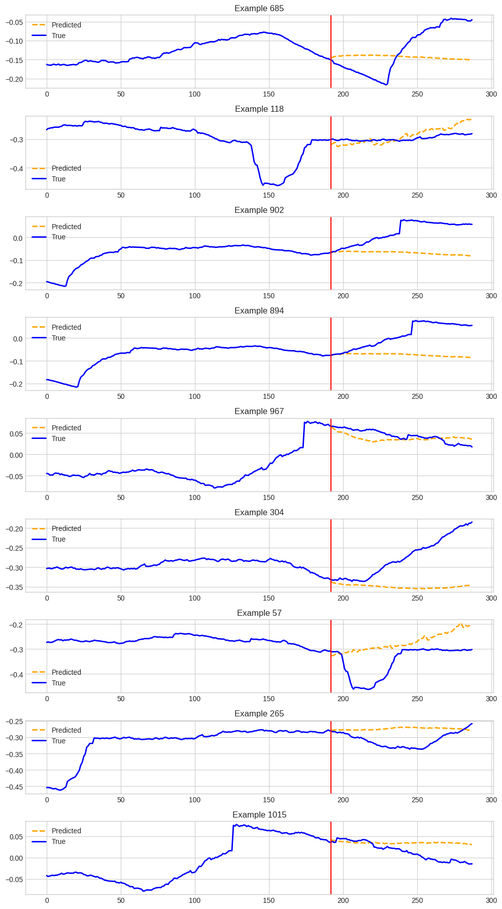
    


```python
labels = data.iloc[:, -1].values
```


```python

```


```python
preds, targets = fewshot_finetune_eval(
    dataset_name=TARGET_DATASET,
    context_length=CONTEXT_LENGTH,
    forecast_length=PREDICTION_LENGTH,
    batch_size=64,
    fewshot_percent=5,
    learning_rate=0.001,
)
```

    INFO:p-30167:t-129979547536256:get_model.py:get_model:Loading model from: ibm-granite/granite-timeseries-ttm-r2


    -------------------- Running few-shot 5% --------------------


    INFO:p-30167:t-129979547536256:get_model.py:get_model:Model loaded successfully from ibm-granite/granite-timeseries-ttm-r2, revision = main.
    INFO:p-30167:t-129979547536256:get_model.py:get_model:[TTM] context_length = 512, prediction_length = 96


    Using learning rate = 0.001


    <div>

      <progress value='121' max='550' style='width:300px; height:20px; vertical-align: middle;'></progress>
      [121/550 04:33 < 16:25, 0.44 it/s, Epoch 11/50]
    </div>
    <table border="1" class="dataframe">
  <thead>
 <tr style="text-align: left;">
      <th>Epoch</th>
      <th>Training Loss</th>
      <th>Validation Loss</th>
    </tr>
  </thead>
  <tbody>
    <tr>
      <td>1</td>
      <td>0.303600</td>
      <td>0.697173</td>
    </tr>
    <tr>
      <td>2</td>
      <td>0.272600</td>
      <td>0.715102</td>
    </tr>
    <tr>
      <td>3</td>
      <td>0.259700</td>
      <td>0.783004</td>
    </tr>
    <tr>
      <td>4</td>
      <td>0.247500</td>
      <td>0.826494</td>
    </tr>
    <tr>
      <td>5</td>
      <td>0.235200</td>
      <td>0.862266</td>
    </tr>
    <tr>
      <td>6</td>
      <td>0.226100</td>
      <td>0.857260</td>
    </tr>
    <tr>
      <td>7</td>
      <td>0.214800</td>
      <td>0.922765</td>
    </tr>
    <tr>
      <td>8</td>
      <td>0.205600</td>
      <td>0.962535</td>
    </tr>
    <tr>
      <td>9</td>
      <td>0.198200</td>
      <td>0.884157</td>
    </tr>
    <tr>
      <td>10</td>
      <td>0.184600</td>
      <td>0.931959</td>
    </tr>
    <tr>
      <td>11</td>
      <td>0.174800</td>
      <td>0.954199</td>
    </tr>
  </tbody>
</table><p>


    [TrackingCallback] Mean Epoch Time = 14.324680805206299 seconds, Total Train Time = 275.92447113990784
    ++++++++++++++++++++ Test MSE after few-shot 5% fine-tuning ++++++++++++++++++++


    {'eval_loss': 1.3818395137786865, 'eval_runtime': 10.5941, 'eval_samples_per_second': 179.817, 'eval_steps_per_second': 2.832, 'epoch': 11.0}
    ++++++++++++++++++++++++++++++++++++++++++++++++++++++++++++
    (1905, 96, 25)
    (1905, 25, 8, 192)


    [Debug] preds shape: (1905, 96, 25), targets shape: (1905, 96, 25)


    ---------------------------------------------------------------------------

    NameError                                 Traceback (most recent call last)

    Cell In[9], line 10
          1 preds, targets = fewshot_finetune_eval(
          2     dataset_name=TARGET_DATASET,
          3     context_length=CONTEXT_LENGTH,
       (...)
          7     learning_rate=0.001,
          8 )
    ---> 10 raw_scores = np.mean(np.abs(preds - targets), axis=(1, 2))


    NameError: name 'np' is not defined


    
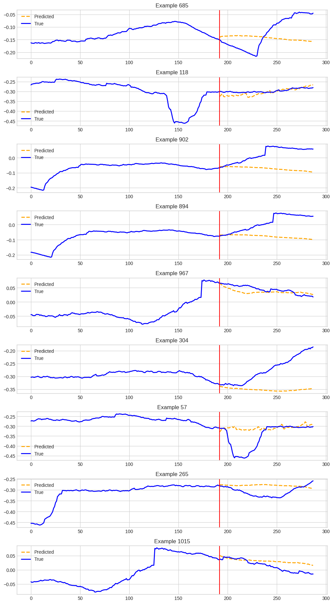
    


```python
import numpy as np
raw_scores = np.mean(np.abs(preds - targets), axis=(1, 2))  # shape: (n_predictions,)
```


```python
padded_scores = np.zeros_like(labels, dtype=float)
padding = len(labels) - len(raw_scores)
padded_scores[padding:] = raw_scores
```


```python
import matplotlib.pyplot as plt

channel = 0  # feature index to visualize
actuals = data.iloc[:, channel].values

plt.figure(figsize=(15, 5))
plt.plot(actuals, label='Actual values')
plt.scatter(np.where(labels == 1), actuals[labels == 1], color='red', label='Anomalies', zorder=5)
plt.legend()
plt.title('Anomalies in Actual Time Series')
plt.show()
```


    
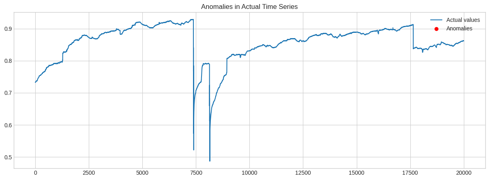
    


```python

```
